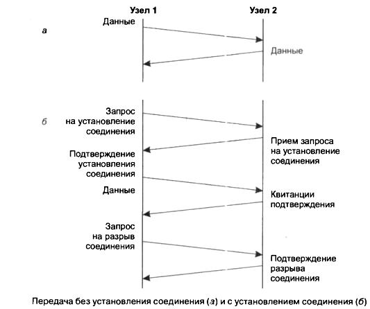
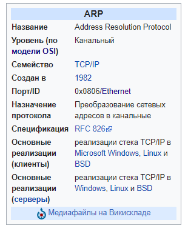
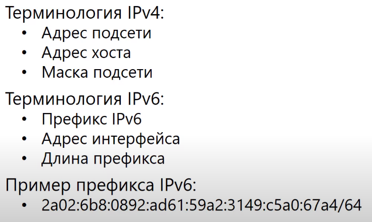

## Содержание


1. [Первый уровень ЭМВОС. Методы кодирования. Физические среды передачи информации. Протоколы и устройства первого уровня ЭМВОС.](#1)
2. [Коммутация каналов и пакетов. Принципы передачи с установлением логического соединения и виртуального канала.](#2)
3. [Система доменных имен. Механизм работы протокола. Ресурсные записи. (DNS)](#3)
4. [Подуровень управления логической связью. Структура данных. Процедуры работы подуровня. Конструкция подзаголовков.](#4)
5. [Транспортный уровень модели OSI. Протокол TCP. Логика работы. Структура заголовка.](#5)
6. [Логическая адресация версии 4. Классовая адресация. CIDR. VLSM. Особые адреса.](#6)
7. [Работа протокола IPv4. Логика работы. Структура заголовка.](#7)
8. [Управляемое широковещание в адресации версии 4.](#8)
9. [Протокол обнаружения соседей в адресации версии 6. (NDP)](#9)
10. [Протокол разрешения физического адреса по известному логическому адресу. Логика работа протокола. Структура заголовка протокола. (ARP)](#10)
11. [Физическая адресация. Виды адресов. Структура адреса.](#11)
12. [Протокол IEEE 802-1Q. Структура заголовка. Логика работа. Связь с вышестоящим и нижестоящим уровнями ЭМВОС.](#12)
13. [Логическая адресация версии 6. Префикс. Типы адресов. Виды вещания. Особые адреса. Преобразование адреса в канальный адрес.](#13)
14. [ICMP v6. Логика работы. Структура заголовка.](#14)
15. [Плоские имена. Протокол NetBIOS. Логика работы.](#15)
16. [Протокол разрешения имен в адресации версии 4. Логика работы. Структура заголовка. (DNS)](#16)
17. [Протокол управления доступа к среде по витой паре. Логика работы.](#17)
18. [Транспортный уровень модели OSI. Протокол UDP. Логика работы. Структура заголовка.](#18)
19. [Протокол управления межсетевыми сообщениями в адресации версии 4.](#19)
20. [История первых сетей. Концепция Интернет и его архитектура.](#20)
21. [ICMP v4. Логика работы. Структура заголовка.](#21)
22. [Протокол динамической конфигурации узлов. (DHCP)](#22)

___
[Содержание](#содержание)
## 1
## Первый уровень ЭМВОС. Методы кодирования. Физические среды передачи информации. Протоколы и устройства первого уровня ЭМВОС.

### Физический уровень

<details>
<summary>Click to expand!</summary>
Физический уровень — первый уровень сетевой модели OSI. Это нижний уровень модели OSI — физическая и электрическая среда для передачи данных. Физический уровень описывает способы передачи бит (а не пакетов данных) через физические среды линий связи, соединяющие сетевые устройства. На этом уровне описываются параметры сигналов, такие как амплитуда, частота, фаза, используемая модуляция, манипуляция. Решаются вопросы, связанные с синхронизацией, избавлением от помех, скоростью передачи данных.

Если посмотреть с той точки зрения, что сеть включает в себя оборудование и программы, контролирующие оборудование, то здесь физический слой будет относиться именно к первой части определения.

Этот уровень, так же как канальный и сетевой, является сетезависимым.

Физический уровень (англ. physical layer) — нижний уровень модели, который определяет метод передачи данных, представленных в двоичном виде, от одного устройства (компьютера) к другому. Составлением таких методов занимаются разные организации, в том числе: Институт инженеров по электротехнике и электронике, Альянс электронной промышленности, Европейский институт телекоммуникационных стандартов и другие. Осуществляют передачу электрических или оптических сигналов в кабель или в радиоэфир и, соответственно, их приём и преобразование в биты данных в соответствии с методами кодирования цифровых сигналов.

Функции физического уровня реализуются на всех устройствах, подключенных к сети. Со стороны компьютера функции физического уровня выполняются сетевым адаптером или последовательным портом. К физическому уровню относятся физические, электрические и механические интерфейсы между двумя системами. Физический уровень определяет такие виды сред передачи данных как оптоволокно, витая пара, коаксиальный кабель, спутниковый канал передач данных и т. п. Стандартными типами сетевых интерфейсов, относящимися к физическому уровню, являются: V.35, RS-232, RS-485, RJ-11, RJ-45, разъёмы AUI и BNC.

При разработке стеков протоколов на этом уровне решаются задачи синхронизации и линейного кодирования. К таким способам кодирования относится код NRZ, код RZ, MLT-3, PAM5, Манчестер II.

###### Устройства
* концентраторы или хаб (от англ. hub -- центр) - устройство для объединения компьютеров в сеть Ethernet c применением кабельной инфраструктуры типа витая пара. В настоящее время вытеснены сетевыми коммутаторами.
* повторители сигнала
* медиаконвертеры - это устройство, преобразующее среду распространения сигнала из одного типа в другой. Чаще всего средой распространения сигнала являются медные провода и оптические кабели.

EIA (англ. Electronic Industries Alliance) — Альянс отраслей электронной промышленности. Расположенная в США профессиональная организация, разрабатывающая электрические и функциональные стандарты с идентификатором RS (Recommended Standards).
Стандарты маркировались буквами RS (Recommended Standards), однако EIA официально заменил «RS» на «EIA/TIA» с целью облегчить идентификацию происхождения своих стандартов. Многие инженеры продолжают использовать старое обозначение.
Стандарты RS, как следует из названия, являются рекомендованными, то есть они никем не приняты.

##### Протоколы
*  IEEE 802.15 (Bluetooth)
*  IRDA (InfraRed Data Association) передачи данных с использованием инфракрасного диапазона световых волн в качестве среды передач
*  EIA RS-232 — стандарт физического уровня для асинхронного интерфейса (UART). Устройство, поддерживающее этот стандарт, широко известно как последовательный порт персональных компьютеров.
*  EIA-422
*  EIA-423
*  RS-449
*  RS-485
*  xDSL - (англ. digital subscriber line, цифровая абонентская линия) — семейство технологий, позволяющих значительно повысить пропускную способность абонентской линии телефонной сети общего пользования путём использования эффективных линейных кодов и адаптивных методов коррекции искажений линии на основе современных достижений микроэлектроники и методов цифровой обработки сигнала.
*  ISDN (англ. Integrated Services Digital Network) — данная технология обеспечивает передачу цифрового сигнала по телефонным каналам с предоставлением различных служб.
*  SONET/SDH
*  802.11 Wi-Fi /  IEEE 802.11 - набор стандартов связи для коммуникации в беспроводной локальной сетевой зоне частотных диапазонов 0,9; 2,4; 3,6; 5 и 60 ГГц.
*  Etherloop является своего рода «новым поколением» DSL-технологии, которая сочетает в себе черты Ethernet и DSL. Эта технология позволяет совмещать передачу голоса и данных по стандартным телефонным линиям. При хороших условиях позволяет передавать данные со скоростью до 6 мегабит в секунду на расстоянии до ~6400 метров.
*  GSM Um radio interface (Global System for Mobile Communications) (русск. СПС-900) — глобальный стандарт цифровой мобильной сотовой связи с разделением каналов по времени (TDMA) и частоте (FDMA). Разработан под эгидой Европейского института стандартизации электросвязи (ETSI) в конце 1980-х годов.
*  ITU и ITU-T
*  TransferJet[en]
*  ARINC 818
*  G.hn/G.9960


###### Единица измерения
Единица измерения, используемая на этом слое — бит, то есть физический уровень осуществляет передачу потока битов по соответствующей физической среде через соответствующий интерфейс.

###### Технческие средства 
* Кабель (коаксиальный, витая пара, оптоволоконный, беспроводная среда)
* Разъем (к примеру: 8P8C)
* Коммутационная панель
* Плинт
* Повторитель сигналов
* Многопортовые повторители или концентраторы
* Преобразователи среды или медиаконвертеры (transceiver)
* MAU (Media Access Unit)
* Сетевой адаптер (NIC) — он также задействован и на канальном уровне
* PHY

###### Стандарты
Такие сетевые стандарты как 100BASE-T или 1000BASE-X базируются на физическом слое.

Число 100 в 100BASE-T означает 100 Мегабит (100000000 бит), а 1000 в 1000BASE-X, соответственно, означает Гигабит.
Слово «BASE» — это сокращение от baseband.
Аббревиатура «T» — это обозначение кабеля витая пара.
Набор стандартов IEEE 802.3, определяющих канальный и физический уровень в проводной сети Ethernet, как правило, реализуется в локальных сетях (LAN), а в некоторых случаях — и в глобальных (WAN).[3]

en:Physical Coding Sublayer
en:Physical Medium Dependent

</details>

___
[Содержание](#содержание)
## 2
## Коммутация каналов и пакетов. Принципы передачи с установлением логического соединения и виртуального канала.

### Коммутация каналов

Сеть с коммутацией каналов — вид телекоммуникационной сети, в которой между двумя узлами сети должно быть установлено соединение (канал), прежде чем они начнут обмен информацией. Данное соединение на протяжении всего сеанса обмена информацией может использоваться только указанными двумя узлами. После завершения обмена соединение должно быть соответствующим образом разорвано.

Типичным примером являются ранние телефонные сети. Абонент должен попросить оператора соединить его с другим абонентом, подключённым к тому же коммутатору или иному коммутатору через линию связи (и другому оператору). В любом случае, конечным результатом было физическое электрическое соединение между телефонными аппаратами абонентов в течение всего разговора. Проводник, задействованный для подключения, не мог быть использован для передачи других разговоров в это время, даже если абоненты на самом деле не разговаривали и на линии была тишина.

Позже стало возможным уплотнение одной физической линии для образования в ней нескольких каналов, например, с помощью мультиплексирования с разделением по времени (англ. Time Division Multiplexing, TDM). Несмотря на это, один канал уплотнённой линии также мог использоваться лишь одной парой абонентов.

Широко известными примерами сетевых технологий с коммутацией каналов являются сети X.25, ATM и Frame Relay. Также, технику коммутации каналов использовал интерфейс QuickRing.

##### Преимущества
Высокая стабильность параметров канала во времени.
Отсутствие необходимости в передаче служебной информации после установления соединения.
Коммутация каналов может использоваться как в аналоговых, так и в цифровых сетях связи, в отличие от коммутации пакетами, которая возможна только в цифровых сетях.

##### Недостатки
Коммутация каналов считается недостаточно эффективным способом коммутации, потому что канальная ёмкость частично расходуется на поддержание соединений, которые установлены, но (в настоящее время) не используются.

#### Альтернатива 
Коммутация каналов принципиально отличается от коммутации пакетов, при которой передаваемые данные (например, оцифрованный звук или данные по компьютерной сети) разделяются на отдельные пакеты, которые отдельно передаются через сеть общего пользования.

### Коммутация пакетов

Коммутация пакетов (англ. packet switching) — способ динамического распределения ресурсов сети связи[1] за счёт передачи и коммутации оцифрованной информации в виде частей небольшого размера — так называемых пакетов, которые передаются по сети в общем случае независимо друг от друга (дейтаграммы) либо последовательно друг за другом по виртуальным соединениям. Узел-приёмник из пакетов собирает сообщение. В таких сетях по одной физической линии связи могут обмениваться данными много узлов.

При коммутации пакетов все передаваемые пользователем цифровые данные разбиваются передающим узлом на небольшие (до нескольких килобайт) части — пакеты (англ. packet). Каждый пакет оснащается заголовком, в котором указывается, как минимум, адрес узла-получателя и номер пакета. Передача пакетов по сети происходит либо независимо друг от друга, тогда пакеты называют дейтаграммами (datagram), а режим индивидуальной коммутации пакетов — дейтаграммным режимом, либо по виртуальным соединениям, то есть в режиме, «ориентированном на соединения» (англ. Connection-oriented communication). Коммутаторы такой сети имеют внутреннюю буферную память для временного хранения пакетов, что позволяет сглаживать пульсации трафика на линиях связи между коммутаторами.

##### Преимущества
* Эффективность использования пропускной способности.
* При перегрузке сети никого не «выбрасывает» с сообщением «сеть занята», сеть просто снижает всем или нескольким абонентам скорость передачи.
* Абонент, использующий свой канал не полностью, фактически отдаёт пропускную способность сети остальным абонентам.
* Меньшие затраты 

##### Недостатки
* Коммутацию пакетов способно осуществлять только сложное устройство; без микропроцессорной техники пакетную сеть наладить практически невозможно.
* Пропускная способность расходуется на передачу технических данных (служебной информации).
* Задержки доставки, в том числе переменные, из-за того, что при занятости исходящего канала пакет может ждать своей очереди в коммутаторе.

Сеть с коммутацией пакетов отличается от сети с коммутацией каналов тем, что с определённой вероятностью может замедлять процесс взаимодействия каждой конкретной пары узлов, поскольку их пакеты могут ожидать в коммутаторах, пока передадутся другие пакеты. Это особенно критично для служб, работающих в реальном масштабе времени (аудио, видео). Однако общая эффективность (объем передаваемых данных в единицу времени) при коммутации пакетов будет выше, чем при коммутации каналов. Это связано с тем, что трафик каждого отдельного абонента носит пульсирующий характер, а пульсации разных абонентов в соответствии с законом больших чисел распределяются во времени, делая нагрузку более равномерной.

### Режимы без установления соединения и с установлением соединения
Коммутацию пакетов можно разделить на коммутацию пакетов без установления соединения, также известную как коммутация дейтаграмм, и коммутацию пакетов с установлением соединения, также известную как коммутация виртуальных каналов. Примерами систем без установления соединения являются Ethernet, Интернет-протокол (IP) и протокол дейтаграмм пользователя (UDP). Системы, ориентированные на соединение, включают X.25, Frame Relay, многопротокольную коммутацию по меткам (MPLS) и протокол управления передачей (TCP).

В режиме без установления соединения каждый пакет помечается адресом назначения, адресом источника и номерами портов. Также на нем может быть указан порядковый номер пакета. Эта информация задается в заранее установленном пути (о чем речь?! бессмыслица. нужна правка специалиста), чтобы помочь пакету найти свой путь к месту назначения, но означает, что требуется больше информации в заголовке пакета, который, следовательно, становится больше. Пакеты маршрутизируются индивидуально, иногда по разным путям, что приводит к нарушению порядка доставки. В месте назначения исходное сообщение может быть повторно собрано в правильном порядке на основе порядковых номеров пакетов. Таким образом, виртуальный канал, переносящий поток байтов, предоставляется приложению протоколом транспортного уровня, хотя сеть предоставляет только услугу сетевого уровня без установления соединения.

Передача с установлением соединения требует фазы настройки, чтобы установить параметры связи перед передачей любого пакета. Протоколы сигнализации, используемые для настройки, позволяют приложению выставлять свои требования и обнаруживать параметры канала. Допустимые значения параметров услуги могут быть согласованы. Передаваемые пакеты могут включать в себя идентификатор соединения, а не адресную информацию, а заголовок пакета может быть меньше, поскольку он должен содержать только этот код и информацию, такую как длина, временная метка или порядковый номер, которые отличаются для разных пакетов. В этом случае адресная информация передается каждому узлу только на этапе установки соединения, когда обнаруживается маршрут к пункту назначения и добавляется запись в таблицу коммутации в каждом сетевом узле, через который проходит соединение. Когда используется идентификатор соединения, для маршрутизации пакета узел должен найти идентификатор соединения в таблице.

Протоколы транспортного уровня, ориентированные на установление соединения, такие как TCP, предоставляют услуги, ориентированные на установление соединения, с помощью базовой сети без установления соединения. В этом случае принцип сквозного соединения требует, чтобы конечные узлы, а не сама сеть, отвечали за поведение, ориентированное на соединение.

#### Коммутация пакетов в сетях
Коммутация пакетов используется для оптимизации использования пропускной способности канала, доступной в цифровых телекоммуникационных сетях, таких как компьютерные сети, и минимизации задержки передачи (время, которое требуется для передачи данных по сети), а также для повышения надежности связи.

Коммутация пакетов используется в Интернете и большинстве локальных сетей. Интернет реализуется с помощью пакета Internet Protocol Suite с использованием различных технологий канального уровня. Например, распространены Ethernet и Frame Relay. Новые технологии мобильных телефонов (например, GSM, LTE) также используют коммутацию пакетов. Коммутация пакетов связана с сетями без установления соединения, поскольку в этих системах не требуется заключать соглашение о соединении между взаимодействующими сторонами до обмена данными.

В X.25 широко используется коммутация пакетов, поскольку, несмотря на то, что он основан на методах коммутации пакетов, он предоставляет пользователю виртуальные каналы. Эти виртуальные каналы несут пакеты переменной длины. В 1978 году X.25 предоставил первую международную коммерческую сеть с коммутацией пакетов, International Packet Switched Service (IPSS). Асинхронный режим передачи (ATM) также представляет собой технологию виртуальных каналов, в которой используется коммутация пакетов, ориентированная на ретрансляцию ячеек фиксированной длины.

Такие технологии, как многопротокольная коммутация по меткам (MPLS) и протокол резервирования ресурсов (RSVP), создают виртуальные каналы поверх сетей дейтаграмм. MPLS и его предшественники, а также ATM были названы технологиями «быстрых пакетов». MPLS действительно был назван «банкоматом без ячеек». Виртуальные каналы особенно полезны при создании надежных механизмов переключения при отказе и распределении полосы пропускания для чувствительных к задержкам приложений.

#### Логическое соединение 
Процедура согласования двумя конечными узлами сети некоторых параметров процесса обмена пакетами называется установлением логического соединения. Параметры, о которых договариваются два взаимодействующих узла, называются параметрами логического соединения.

Наличие логического соединения позволяет более рационально по сравнению с дейтаграммным способом обрабатывать пакеты. Например, при потере нескольких предыдущих пакетов может быть снижена скорость отправки последующих. Или благодаря нумерации пакетов и отслеживанию номеров отправленных и принятых пакетов можно повысить надежность путем отбрасывания дубликатов, упорядочивания поступивших и повторения передачи потерянных пакетов.

Параметры соединения могут быть: постоянными, то есть не изменяющимися в течение всего соединения (например, идентификатор соединения, способ шифрования пакета или максимальный размер поля данных пакета), или переменными, то есть динамически отражающими текущее состояние соединения (например, последовательные номера пере даваемых пакетов).

Когда отправитель и получатель фиксируют начало нового соединения, они, прежде всего, «договариваются» о начальных значениях параметров процедуры обмена и только после этого начинают передачу собственно данных.

Передача с установлением соединения более надежна, но требует больше времени для передачи данных и вычислительных затрат от конечных узлов, что иллюстрирует рисунке ниже.



Процедура установления соединения состоит обычно из трех шагов.

1. Узел-инициатор соединения отправляет узлу-получателю служебный пакет с предложением установить соединение.

2. Если узел-получатель согласен с этим, то он посылает в ответ другой служебный пакет, подтверждающий установление соединения и предлагающий некоторые параметры, которые будут использоваться в рамках данного логического соединения. Это могут быть, например, идентификатор соединения, количество кадров, которые можно отправить без получения подтверждения и т. п.

3. Узел-инициатор соединения может закончить процесс установления соединения отправкой третьего служебного пакета, в котором сообщит, что предложенные параметры ему подходят.

Логическое соединение может быть рассчитано на передачу данных как в одном направлении — от инициатора соединения, так и в обоих направлениях. После передачи некоторого законченного набора данных, например определенного файла, узел-отправитель инициирует разрыв данного логического соединения, посылая соответствующий служебныйкадр.

Заметим, что, в отличие от передачи дейтаграммного типа, в которой поддерживается только один тип кадра — информационный, передаче с установлением соединения должна поддерживать как минимум два типа кадров — информационные кадры переносят собственно пользовательские данные, а служебные предназначаются для установления (разрыва) соединения.

После того как соединение установлено и все параметры согласованы, конечные узлы начинают передачу собственно данных. Пакеты данных обрабатываются коммутаторами точно так же, как и при дейтаграммной передаче: из заголовков пакетов извлекаются адреса назначения и сравниваются с записями в таблицах коммутации, содержащих информацию о следующих шагах по маршруту. Так же как дейтаграммы, пакеты, относящиеся к одному логическому соединению, в некоторых случаях (например, при отказе линии связи) могут доставляться адресату по разным маршрутам.

Однако передача с установлением соединения имеет важное отличие от дейтаграммной передачи, поскольку в ней помимо обработки пакетов на коммутаторах имеет место дополнительная обработка пакетов на конечных узлах. Например, если при установлении соединения была оговорена передача данных в зашифрованном виде, то шифрование пакетов выполняется узлом-отправителем, а расшифровка — узлом-получателем. Аналогично, для обеспечения в рамках логического соединения надежности всю работу по нумерации пакетов, отслеживанию номеров доставленных и недоставленных пакетов, посылки копий и отбрасывания дубликатов берут на себя конечные узлы.

Механизм установления логических соединений позволяет реализовывать дифференцированное обслуживание информационных потоков. Разное обслуживание могут получить даже потоки, относящиеся к одной и той же паре конечных узлов. Например, пара конечных узлов может установить два параллельно работающих логических соединения, в одном из которых передавать данные в зашифрованном виде, а в другом — открытым текстом.

Как видим, передача с установлением соединения предоставляет больше возможностей в плане надежности и безопасности обмена данными, чем дейтаграммная передача. Однако этот способ более медленный, так как он подразумевает дополнительные вычислительные затраты на установление и поддержание логического соединения.

#### Виртуальное соединение
Виртуальное соединение (ВС), виртуальный канал (ВК) (англ. VC - Virtual Circuit) — канал связи в сети коммутации пакетов, соединяющий двух и более абонентов, и состоящий из последовательных физических звеньев системы передачи между узлами связи (коммутаторами), а также из физических и логических звеньев внутри коммутаторов на пути между указанными абонентами. Логическое звено управляет физическим звеном и они оба одновременно организуются на этапе установления сквозного ВС между абонентами.

Логическое звено представляет собой запись в памяти коммутатора соответствия идентификатора входящего логического канала (ЛК), ожидаемого в заголовке пакета на данном входящем физическом порту, идентификатору исходящего ЛК и номеру исходящего физического порта.

Как только на данном входящем порту появляется пакет для передачи, логическое звено активируется и задействует соответствующее физическое звено, которое с помощью коммутационного поля передаёт пакет в исходящий порт. При этом входящий идентификатор ЛК (ИЛК) в заголовке пакета заменяется на исходящий ИЛК. Таким образом, помимо физической коммутации, осуществляется и логическая коммутация.

ВС обеспечивает передачу пакетов с сохранением их исходной последовательности[1] («строго друг за другом»). Каждый такой пакет содержит только идентификатор ближайшего логического канала в звене, и не несёт полную адресную информацию места назначения, в отличие от дейтаграмм. При разъединении ВС соответствующие ему записи в памяти коммутаторов стираются, и на их место могут быть записаны данные нового ВС.

#### Концепция Виртуального соединения
Согласно книге одного из пионеров коммутации пакетов и сотрудника Национальной физической лаборатории Великобритании Дональда Дэвиса и соавторов, концепция виртуального канала была предложена в исследованиях корпорации Рэнд, США[2]. Однако тогда под виртуальным каналом, или точнее, виртуальным соединением (англ. VC - Virtual Connection)[3] понималось соединение, устанавливаемое по запросу оконечного пользователя сети с другим оконечным пользователем сети с тем, что сама сеть представлялась пользователю как «чёрный ящик с соединением, установленным через всю территорию Соединённых Штатов»[3]. Этот «чёрный ящик» являлся проектируемой распределённой сетью с децентрализованным принятием решений каждым «обучающимся» коммутатором при использовании адаптивной маршрутизации. Сеть предназначалась для работы в экстремальных ситуациях, с выходом из строя её элементов, и речи о реализации ВС внутри сети не шло.

Термин «виртуальный» в настоящей статье подчёркивает тот факт, что, хотя канал и существует постоянно во всё время сеанса связи между абонентами, но при отсутствии активности корреспондирующих сторон физические ресурсы, через которые проходит данное ВС, такие как тракты передачи между узлами сети, и соответствующие участки коммутационных полей этих узлов выделены не только под данное ВС, но могут использоваться и другими ВС. А также и при активности всех сторон физические ресурсы могут использоваться совместно, по принципу статистического мультиплексирования пакетов (др. словами, мультиплексирования по требованию[4]).

Таким образом, ВС обладает некоторыми свойствами как коммутации каналов — за счёт сохранения исходного порядка следования пакетов, так и коммутации пакетов — за счёт возможности их статистического мультиплексирования.

ВС могут быть как коммутируемыми (англ. SVC - Switched Virtual Circuit) по инициативе абонентов с помощью соответствующей технической процедуры по типу набора номера в обычной телефонной сети, так и постоянными (англ. PVC - Permanent Virtual Circuit), устанавливаемыми по обращению абонентов к администрации сети, на более-менее продолжительный срок, например, на три месяца, полгода или год.

___
[Содержание](#содержание)
## 3 
## Система доменных имен. Механизм работы протокола. Ресурсные записи.

### DNS
DNS (англ. Domain Name System «система доменных имён») — компьютерная распределённая система для получения информации о доменах. Чаще всего используется для получения IP-адреса по имени хоста (компьютера или устройства), получения информации о маршрутизации почты и/или обслуживающих узлах для протоколов в домене (SRV-запись).

Распределённая база данных DNS поддерживается с помощью иерархии DNS-серверов, взаимодействующих по определённому протоколу.

Основой DNS является представление об иерархической структуре имени и зонах. Каждый сервер, отвечающий за имя, может передать ответственность за дальнейшую часть домена другому серверу (с административной точки зрения — другой организации или человеку), что позволяет возложить ответственность за актуальность информации на серверы различных организаций (людей), отвечающих только за «свою» часть доменного имени.

Начиная с 2010 года в систему DNS внедряются средства проверки целостности передаваемых данных, называемые DNS Security Extensions (DNSSEC). Передаваемые данные не шифруются, но их достоверность проверяется криптографическими способами. Внедряемый стандарт DANE обеспечивает передачу средствами DNS достоверной криптографической информации (сертификатов), используемых для установления безопасных и защищённых соединений транспортного и прикладного уровней.

##### Терминология
* Доме́н (англ. domain «область») — узел в дереве имён, вместе со всеми подчинёнными ему узлами (если таковые имеются), то есть именованная ветвь или поддерево в дереве имён. Структура доменного имени отражает порядок следования узлов в иерархии; доменное имя читается слева направо от младших доменов к доменам высшего уровня (в порядке повышения значимости): вверху находится корневой домен (имеющий идентификатор «.»(точка)), ниже идут домены первого уровня (доменные зоны), затем — домены второго уровня, третьего и т. д. (например, для адреса ru.wikipedia.org. домен первого уровня — org, второго — wikipedia, третьего — ru). DNS позволяет не указывать точку корневого домена.
* Поддомен (англ. subdomain) — подчинённый домен (например, wikipedia.org — поддомен домена org, а ru.wikipedia.org — домена wikipedia.org). Теоретически такое деление может достигать глубины 127 уровней, а каждая метка может содержать до 63 символов, пока общая длина вместе с точками не достигнет 254 символов. Но на практике регистраторы доменных имён используют более строгие ограничения. Например, если у вас есть домен вида mydomain.ru, вы можете создать для него различные поддомены вида mysite1.mydomain.ru, mysite2.mydomain.ru и т. д.
* Ресурсная запись — единица хранения и передачи информации в DNS. Каждая ресурсная запись имеет имя (то есть привязана к определённому доменному имени, узлу в дереве имён), тип и поле данных, формат и содержание которого зависит от типа.
* Зона — часть дерева доменных имён (включая ресурсные записи), размещаемая как единое целое на некотором сервере доменных имён (DNS-сервере, см. ниже), а чаще — одновременно на нескольких серверах (см. ниже). Целью выделения части дерева в отдельную зону является передача ответственности (см. ниже) за соответствующий домен другому лицу или организации. Это называется делегированием (см. ниже). Как связная часть дерева, зона внутри тоже представляет собой дерево. Если рассматривать пространство имён DNS как структуру из зон, а не отдельных узлов/имён, тоже получается дерево; оправданно говорить о родительских и дочерних зонах, о старших и подчинённых. На практике большинство зон 0-го и 1-го уровня ('.', ru, com, …) состоят из единственного узла, которому непосредственно подчиняются дочерние зоны. В больших корпоративных доменах (2-го и более уровней) иногда встречается образование дополнительных подчинённых уровней без выделения их в дочерние зоны.
* Делегирование — операция передачи ответственности за часть дерева доменных имён другому лицу или организации. За счёт делегирования в DNS обеспечивается распределённость администрирования и хранения. Технически делегирование выражается в выделении этой части дерева в отдельную зону, и размещении этой зоны на DNS-сервере (см. ниже), управляемом этим лицом или организацией. При этом в родительскую зону включаются «склеивающие» ресурсные записи (NS и А), содержащие указатели на DNS-сервера дочерней зоны, а вся остальная информация, относящаяся к дочерней зоне, хранится уже на DNS-серверах дочерней зоны.
* DNS-сервер — специализированное ПО для обслуживания DNS, а также компьютер, на котором это ПО выполняется. DNS-сервер может быть ответственным за некоторые зоны и/или может перенаправлять запросы вышестоящим серверам.
* DNS-клиент — специализированная библиотека (или программа) для работы с DNS. В ряде случаев DNS-сервер выступает в роли DNS-клиента.
* Авторитетность (англ. authoritative) — признак размещения зоны на DNS-сервере. Ответы DNS-сервера могут быть двух типов: авторитетные (когда сервер заявляет, что сам отвечает за зону) и неавторитетные (англ. Non-authoritative), когда сервер обрабатывает запрос, и возвращает ответ других серверов. В некоторых случаях вместо передачи запроса дальше DNS-сервер может вернуть уже известное ему (по запросам ранее) значение (режим кеширования).
* DNS-запрос (англ. DNS query) — запрос от клиента (или сервера) серверу. Запрос может быть рекурсивным или нерекурсивным (см. Рекурсия).

#### Принцип работы DNS
Система DNS содержит иерархию DNS-серверов, соответствующую иерархии зон. Каждая зона поддерживается как минимум одним авторитетным сервером DNS (от англ. authoritative — авторитетный), на котором расположена информация о домене.

Имя и IP-адрес не тождественны — один IP-адрес может иметь множество имён, что позволяет поддерживать на одном компьютере множество веб-сайтов (это называется виртуальный хостинг). Обратное тоже справедливо — одному имени может быть сопоставлено множество IP-адресов: это позволяет создавать балансировку нагрузки.

Для повышения устойчивости системы используется множество серверов, содержащих идентичную информацию, а в протоколе есть средства, позволяющие поддерживать синхронность информации, расположенной на разных серверах. Существует 13 корневых серверов, их адреса практически не изменяются.[2]

Протокол DNS использует для работы TCP- или UDP-порт 53 для ответов на запросы. Традиционно запросы и ответы отправляются в виде одной UDP-датаграммы. TCP используется, когда размер данных ответа превышает 512 байт, и для AXFR-запросов.

#### Рекурсия DNS
Термином рекурсия в DNS обозначают алгоритм поведения DNS-сервера: «выполнить от имени клиента полный поиск нужной информации во всей системе DNS, при необходимости обращаясь к другим DNS-серверам».

DNS-запрос может быть рекурсивным — требующим полного поиска, — и нерекурсивным (или итеративным) — не требующим полного поиска.

Аналогично — DNS-сервер может быть рекурсивным (умеющим выполнять полный поиск) и нерекурсивным (не умеющим выполнять полный поиск). Некоторые программы DNS-серверов, например, BIND, можно сконфигурировать так, чтобы запросы одних клиентов выполнялись рекурсивно, а запросы других — нерекурсивно.

Итеративный, если сервер отвечает за ту зону для который пришел запрос он присылает ответ, а если нет то он присылает адрес другого сервера, к которому нужно обратиться с запросом.
Рекурсивный, в этом режиме DNS-сервер сам отправляет необходимые запросы всем DNS серверам пока не найдет необходимый сервер, получит от него ответ и этот ответ возвращается к клиенту.

При ответе на нерекурсивный запрос, а также при неумении или запрете выполнять рекурсивные запросы, DNS-сервер либо возвращает данные о зоне, за которую он ответственен, либо возвращает ошибку. Настройки нерекурсивного сервера, когда при ответе выдаются адреса серверов, которые обладают большим объёмом информации о запрошенной зоне, чем отвечающий сервер (чаще всего — адреса корневых серверов), являются некорректными, и такой сервер может быть использован для организации DoS-атак.

В случае рекурсивного запроса DNS-сервер опрашивает серверы (в порядке убывания уровня зон в имени), пока не найдёт ответ или не обнаружит, что домен не существует (на практике поиск начинается с наиболее близких к искомому DNS-серверов, если информация о них есть в кэше и не устарела, сервер может не запрашивать другие DNS-серверы).

Рассмотрим на примере работу всей системы.

Предположим, мы набрали в браузере адрес ru.wikipedia.org. Браузер ищет соответствие этого адреса IP-адресу в файле hosts. Если файл не содержит соответствия, то далее браузер спрашивает у сервера DNS: «какой IP-адрес у ru.wikipedia.org»? Однако сервер DNS может ничего не знать не только о запрошенном имени, но и даже обо всём домене wikipedia.org. В этом случае сервер обращается к корневому серверу — например, 198.41.0.4. Этот сервер сообщает — «У меня нет информации о данном адресе, но я знаю, что 204.74.112.1 является ответственным за зону org.» Тогда сервер DNS направляет свой запрос к 204.74.112.1, но тот отвечает «У меня нет информации о данном сервере, но я знаю, что 207.142.131.234 является ответственным за зону wikipedia.org.» Наконец, тот же запрос отправляется к третьему DNS-серверу и получает ответ — IP-адрес, который и передаётся клиенту — браузеру.

В данном случае при разрешении имени, то есть в процессе поиска IP по имени:

браузер отправил известному ему DNS-серверу рекурсивный запрос — в ответ на такой тип запроса сервер обязан вернуть «готовый результат», то есть IP-адрес, либо пустой ответ и код ошибки NXDOMAIN;
DNS-сервер, получивший запрос от браузера, последовательно отправлял нерекурсивные запросы, на которые получал от других DNS-серверов ответы, пока не получил ответ от сервера, ответственного за запрошенную зону;
остальные упоминавшиеся DNS-серверы обрабатывали запросы нерекурсивно (и, скорее всего, не стали бы обрабатывать запросы рекурсивно, даже если бы такое требование стояло в запросе).
Иногда допускается, чтобы запрошенный сервер передавал рекурсивный запрос «вышестоящему» DNS-серверу и дожидался готового ответа.

При рекурсивной обработке запросов все ответы проходят через DNS-сервер, и он получает возможность кэшировать их. Повторный запрос на те же имена обычно не идёт дальше кэша сервера, обращения к другим серверам не происходит вообще. Допустимое время хранения ответов в кэше приходит вместе с ответами (поле TTL ресурсной записи).

Рекурсивные запросы требуют больше ресурсов от сервера (и создают больше трафика), так что обычно принимаются от «известных» владельцу сервера узлов (например, провайдер предоставляет возможность делать рекурсивные запросы только своим клиентам, в корпоративной сети рекурсивные запросы принимаются только из локального сегмента). Нерекурсивные запросы обычно принимаются ото всех узлов сети (и содержательный ответ даётся только на запросы о зоне, которая размещена на узле, на DNS-запрос о других зонах обычно возвращаются адреса других серверов).

#### Ключевые характеристики DNS

DNS обладает следующими характеристиками:

* Распределённость администрирования. Ответственность за разные части иерархической структуры несут разные люди или организации.
* Распределённость хранения информации. Каждый узел сети в обязательном порядке должен хранить только те данные, которые входят в его зону ответственности, и (возможно) адреса корневых DNS-серверов.
* Кэширование информации. Узел может хранить некоторое количество данных не из своей зоны ответственности для уменьшения нагрузки на сеть.
* Иерархическая структура, в которой все узлы объединены в дерево, и каждый узел может или самостоятельно определять работу нижестоящих узлов, или делегировать (передавать) их другим узлам.
* Резервирование. За хранение и обслуживание своих узлов (зон) отвечают (обычно) несколько серверов, разделённые как физически, так и логически, что обеспечивает сохранность данных и продолжение работы даже в случае сбоя одного из узлов.

DNS важна для работы Интернета, так как для соединения с узлом необходима информация о его IP-адресе, а для людей проще запоминать буквенные (обычно осмысленные) адреса, чем последовательность цифр IP-адреса. В некоторых случаях это позволяет использовать виртуальные серверы, например, HTTP-серверы, различая их по имени запроса. Первоначально преобразование между доменными и IP-адресами производилось с использованием специального текстового файла hosts, который составлялся централизованно и автоматически рассылался на каждую из машин в своей локальной сети. С ростом Сети возникла необходимость в эффективном, автоматизированном механизме, которым и стала DNS.

DNS была разработана Полом Мокапетрисом в 1983 году; оригинальное описание механизмов работы содержится в RFC 882 и RFC 883. В 1987 публикация RFC 1034 и RFC 1035 изменила спецификацию DNS и отменила RFC 882, RFC 883 и RFC 973 как устаревшие.
#### Типы ресурсных записей DNS


| Тип                                      | Расшифровка названия (англ.)             | Код | Описание                                 | Употребимость                            | RFC                                      |
|------------------------------------------|------------------------------------------|-----|------------------------------------------|------------------------------------------|------------------------------------------|
| <b style="font-weight: 700;">A**         | Address                                  | 1   | Адресная запись, соответствие между именем и IP-адресом | одна из самых часто используемых записей | <a class="external mw-magiclink-rfc" rel="nofollow" href="https://tools.ietf.org/html/rfc1035" style="text-decoration: none; color: rgb(51, 102, 187); background: url(&quot;/w/skins/Vector/resources/common/images/external-link-ltr-icon.svg?48e54&quot;) right center no-repeat; padding-right: 13px;">RFC 1035</a> |
| A6                                       | Address version 6                        | 38  | Адрес в формате<span> </span><a href="https://ru.wikipedia.org/wiki/IPv6" title="IPv6" style="text-decoration: none; color: rgb(6, 69, 173); background: none;">IPv6</a> | заменена на AAAA из-за чрезмерной сложности в реализации, статус «экспериментальной».<sup id="cite_ref-1" class="reference" style="line-height: 1em; unicode-bidi: isolate; white-space: nowrap; font-weight: normal; font-style: normal; font-size: 11.2px;"><a href="https://ru.wikipedia.org/wiki/%D0%A2%D0%B8%D0%BF%D1%8B_%D1%80%D0%B5%D1%81%D1%83%D1%80%D1%81%D0%BD%D1%8B%D1%85_%D0%B7%D0%B0%D0%BF%D0%B8%D1%81%D0%B5%D0%B9_DNS#cite_note-1" style="text-decoration: none; color: rgb(6, 69, 173); background: none;">[1]</a></sup> | <a class="external mw-magiclink-rfc" rel="nofollow" href="https://tools.ietf.org/html/rfc3363" style="text-decoration: none; color: rgb(51, 102, 187); background: url(&quot;/w/skins/Vector/resources/common/images/external-link-ltr-icon.svg?48e54&quot;) right center no-repeat; padding-right: 13px;">RFC 3363</a>,<span> </span><a class="external mw-magiclink-rfc" rel="nofollow" href="https://tools.ietf.org/html/rfc2874" style="text-decoration: none; color: rgb(51, 102, 187); background: url(&quot;/w/skins/Vector/resources/common/images/external-link-ltr-icon.svg?48e54&quot;) right center no-repeat; padding-right: 13px;">RFC 2874</a> |
| <b style="font-weight: 700;">AAAA**      | A+1+1+1 (A использовался для IPv4, AAAA для IPv6) | 28  | Адрес в формате<span> </span><a href="https://ru.wikipedia.org/wiki/IPv6" title="IPv6" style="text-decoration: none; color: rgb(6, 69, 173); background: none;">IPv6</a> | Эквивалент А для IPV4                    | <a class="external mw-magiclink-rfc" rel="nofollow" href="https://tools.ietf.org/html/rfc3596" style="text-decoration: none; color: rgb(51, 102, 187); background: url(&quot;/w/skins/Vector/resources/common/images/external-link-ltr-icon.svg?48e54&quot;) right center no-repeat; padding-right: 13px;">RFC 3596</a> |
| AFSDB                                    | AFS database                             | 18  | Расположение базы данных<span> </span><a href="https://ru.wikipedia.org/wiki/AFS" class="mw-redirect" title="AFS" style="text-decoration: none; color: rgb(6, 69, 173); background: none;">AFS</a> | редкоупотребимая, чаще используется SRV-запись | <a class="external mw-magiclink-rfc" rel="nofollow" href="https://tools.ietf.org/html/rfc1183" style="text-decoration: none; color: rgb(51, 102, 187); background: url(&quot;/w/skins/Vector/resources/common/images/external-link-ltr-icon.svg?48e54&quot;) right center no-repeat; padding-right: 13px;">RFC 1183</a> |
| AVC                                      | Application Visibility and Control       | 258 | Видимость и контроль приложений          |                                          | <a rel="nofollow" class="external text" href="https://www.iana.org/assignments/dns-parameters/AVC/avc-completed-template" style="text-decoration: none; color: rgb(51, 102, 187); background: url(&quot;/w/skins/Vector/resources/common/images/external-link-ltr-icon.svg?48e54&quot;) right center no-repeat; padding-right: 13px;">AVC/avc-completed-template</a> |
| CAA                                      | Certification Authority Restriction      | 257 | Авторизованный центр сертификации        |                                          | <a class="external mw-magiclink-rfc" rel="nofollow" href="https://tools.ietf.org/html/rfc6844" style="text-decoration: none; color: rgb(51, 102, 187); background: url(&quot;/w/skins/Vector/resources/common/images/external-link-ltr-icon.svg?48e54&quot;) right center no-repeat; padding-right: 13px;">RFC 6844</a> |
| <b style="font-weight: 700;">CNAME**     | Canonical name                           | 5   | Каноническое имя для псевдонима (одноуровневая переадресация) | широко используется (но имеет ограничения по применению) | <a class="external mw-magiclink-rfc" rel="nofollow" href="https://tools.ietf.org/html/rfc1035" style="text-decoration: none; color: rgb(51, 102, 187); background: url(&quot;/w/skins/Vector/resources/common/images/external-link-ltr-icon.svg?48e54&quot;) right center no-repeat; padding-right: 13px;">RFC 1035</a> |
| DNAME                                    | Domain Name                              | 39  | Псевдоним для домена                     | ?                                        | <a class="external mw-magiclink-rfc" rel="nofollow" href="https://tools.ietf.org/html/rfc6672" style="text-decoration: none; color: rgb(51, 102, 187); background: url(&quot;/w/skins/Vector/resources/common/images/external-link-ltr-icon.svg?48e54&quot;) right center no-repeat; padding-right: 13px;">RFC 6672</a> |
| DNSKEY                                   | DNS Key record                           | 48  | Ключ подписи в<span> </span><a href="https://ru.wikipedia.org/wiki/DNSSEC" title="DNSSEC" style="text-decoration: none; color: rgb(6, 69, 173); background: none;">DNSSEC</a>. Формат — как в записи KEY. |                                          | <a class="external mw-magiclink-rfc" rel="nofollow" href="https://tools.ietf.org/html/rfc4034" style="text-decoration: none; color: rgb(51, 102, 187); background: url(&quot;/w/skins/Vector/resources/common/images/external-link-ltr-icon.svg?48e54&quot;) right center no-repeat; padding-right: 13px;">RFC 4034</a> |
| DS                                       | Delegation signer                        | 43  | <a href="https://ru.wikipedia.org/wiki/%D0%9E%D1%82%D0%BF%D0%B5%D1%87%D0%B0%D1%82%D0%BE%D0%BA_%D0%BE%D1%82%D0%BA%D1%80%D1%8B%D1%82%D0%BE%D0%B3%D0%BE_%D0%BA%D0%BB%D1%8E%D1%87%D0%B0" title="Отпечаток открытого ключа" style="text-decoration: none; color: rgb(6, 69, 173); background: none;">Отпечаток</a><span> </span>(fingerprint) ключа подписи в<span> </span><a href="https://ru.wikipedia.org/wiki/DNSSEC" title="DNSSEC" style="text-decoration: none; color: rgb(6, 69, 173); background: none;">DNSSEC</a> | <a href="https://ru.wikipedia.org/wiki/DNSSEC" title="DNSSEC" style="text-decoration: none; color: rgb(6, 69, 173); background: none;">DNSSEC</a> | <a class="external mw-magiclink-rfc" rel="nofollow" href="https://tools.ietf.org/html/rfc3658" style="text-decoration: none; color: rgb(51, 102, 187); background: url(&quot;/w/skins/Vector/resources/common/images/external-link-ltr-icon.svg?48e54&quot;) right center no-repeat; padding-right: 13px;">RFC 3658</a> |
| <s>GPOS</s>                              | Geographical position                    | 27  | Географическое положение                 | устарела, см LOC                         | <a class="external mw-magiclink-rfc" rel="nofollow" href="https://tools.ietf.org/html/rfc1712" style="text-decoration: none; color: rgb(51, 102, 187); background: url(&quot;/w/skins/Vector/resources/common/images/external-link-ltr-icon.svg?48e54&quot;) right center no-repeat; padding-right: 13px;">RFC 1712</a> |
| HINFO                                    | Host Information                         | 13  | Информация об узле                       | редкоупотребима                          | <a class="external mw-magiclink-rfc" rel="nofollow" href="https://tools.ietf.org/html/rfc1035" style="text-decoration: none; color: rgb(51, 102, 187); background: url(&quot;/w/skins/Vector/resources/common/images/external-link-ltr-icon.svg?48e54&quot;) right center no-repeat; padding-right: 13px;">RFC 1035</a> |
| ISDN                                     | ISDN address                             | 20  | Адрес в формате<span> </span><a href="https://ru.wikipedia.org/wiki/ISDN" title="ISDN" style="text-decoration: none; color: rgb(6, 69, 173); background: none;">ISDN</a> | редкоупотребима (из-за малой популярности сетей ISDN без IP-маршрутизации) | <a class="external mw-magiclink-rfc" rel="nofollow" href="https://tools.ietf.org/html/rfc1183" style="text-decoration: none; color: rgb(51, 102, 187); background: url(&quot;/w/skins/Vector/resources/common/images/external-link-ltr-icon.svg?48e54&quot;) right center no-repeat; padding-right: 13px;">RFC 1183</a> |
| KEY                                      | Public key                               | 25  | Открытый ключ, используется в<span> </span><a href="https://ru.wikipedia.org/wiki/DNSSEC" title="DNSSEC" style="text-decoration: none; color: rgb(6, 69, 173); background: none;">DNSSEC</a> | малоупотребима                           | <a class="external mw-magiclink-rfc" rel="nofollow" href="https://tools.ietf.org/html/rfc2535" style="text-decoration: none; color: rgb(51, 102, 187); background: url(&quot;/w/skins/Vector/resources/common/images/external-link-ltr-icon.svg?48e54&quot;) right center no-repeat; padding-right: 13px;">RFC 2535</a>,<span> </span><a class="external mw-magiclink-rfc" rel="nofollow" href="https://tools.ietf.org/html/rfc3445" style="text-decoration: none; color: rgb(51, 102, 187); background: url(&quot;/w/skins/Vector/resources/common/images/external-link-ltr-icon.svg?48e54&quot;) right center no-repeat; padding-right: 13px;">RFC 3445</a> |
| KX                                       | Key Exchanger                            | 36  | ?                                        | ?                                        | <a class="external mw-magiclink-rfc" rel="nofollow" href="https://tools.ietf.org/html/rfc2230" style="text-decoration: none; color: rgb(51, 102, 187); background: url(&quot;/w/skins/Vector/resources/common/images/external-link-ltr-icon.svg?48e54&quot;) right center no-repeat; padding-right: 13px;">RFC 2230</a> |
| LOC                                      | Location information                     | 29  | Географическое местоположение домена     | ?                                        | <a class="external mw-magiclink-rfc" rel="nofollow" href="https://tools.ietf.org/html/rfc1876" style="text-decoration: none; color: rgb(51, 102, 187); background: url(&quot;/w/skins/Vector/resources/common/images/external-link-ltr-icon.svg?48e54&quot;) right center no-repeat; padding-right: 13px;">RFC 1876</a> |
| MB                                       | Mailbox                                  | 7   | Почтовый ящик                            | редкоупотребима, экспериментальна        | <a class="external mw-magiclink-rfc" rel="nofollow" href="https://tools.ietf.org/html/rfc1035" style="text-decoration: none; color: rgb(51, 102, 187); background: url(&quot;/w/skins/Vector/resources/common/images/external-link-ltr-icon.svg?48e54&quot;) right center no-repeat; padding-right: 13px;">RFC 1035</a> |
| <s>MD</s>                                | Mail destination                         | 3   | Почтовый адрес                           | устарела                                 | <a class="external mw-magiclink-rfc" rel="nofollow" href="https://tools.ietf.org/html/rfc1035" style="text-decoration: none; color: rgb(51, 102, 187); background: url(&quot;/w/skins/Vector/resources/common/images/external-link-ltr-icon.svg?48e54&quot;) right center no-repeat; padding-right: 13px;">RFC 1035</a> |
| <s>MF</s>                                | Mail forwarder                           | 4   | Перенаправление почты                    | устарела                                 | <a class="external mw-magiclink-rfc" rel="nofollow" href="https://tools.ietf.org/html/rfc1035" style="text-decoration: none; color: rgb(51, 102, 187); background: url(&quot;/w/skins/Vector/resources/common/images/external-link-ltr-icon.svg?48e54&quot;) right center no-repeat; padding-right: 13px;">RFC 1035</a> |
| MG                                       | Mail group member                        | 8   | Номер почтовой группы                    | редкоупотребима, экспериментальна        | <a class="external mw-magiclink-rfc" rel="nofollow" href="https://tools.ietf.org/html/rfc1035" style="text-decoration: none; color: rgb(51, 102, 187); background: url(&quot;/w/skins/Vector/resources/common/images/external-link-ltr-icon.svg?48e54&quot;) right center no-repeat; padding-right: 13px;">RFC 1035</a> |
| MINFO                                    | Mailbox or mailing list information      | 14  | Информация о почтовом ящике или рассылке | экспериментальна                         | <a class="external mw-magiclink-rfc" rel="nofollow" href="https://tools.ietf.org/html/rfc1035" style="text-decoration: none; color: rgb(51, 102, 187); background: url(&quot;/w/skins/Vector/resources/common/images/external-link-ltr-icon.svg?48e54&quot;) right center no-repeat; padding-right: 13px;">RFC 1035</a> |
| MR                                       | Mail rename domain name                  | 9   | ?                                        | редкоупотребима, экспериментальна        | <a class="external mw-magiclink-rfc" rel="nofollow" href="https://tools.ietf.org/html/rfc1035" style="text-decoration: none; color: rgb(51, 102, 187); background: url(&quot;/w/skins/Vector/resources/common/images/external-link-ltr-icon.svg?48e54&quot;) right center no-repeat; padding-right: 13px;">RFC 1035</a> |
| <b style="font-weight: 700;"><a href="https://ru.wikipedia.org/wiki/MX-%D0%B7%D0%B0%D0%BF%D0%B8%D1%81%D1%8C" class="mw-redirect" title="MX-запись" style="text-decoration: none; color: rgb(6, 69, 173); background: none;">MX</a>** | Mail Exchanger                           | 15  | Адрес почтового шлюза для домена. Состоит из двух частей — приоритета (чем число больше, тем ниже приоритет), и адреса узла | критически важна для<span> </span><a href="https://ru.wikipedia.org/wiki/SMTP" title="SMTP" style="text-decoration: none; color: rgb(6, 69, 173); background: none;">SMTP</a>-протокола, основа маршрутизации<span> </span><a href="https://ru.wikipedia.org/wiki/%D0%AD%D0%BB%D0%B5%D0%BA%D1%82%D1%80%D0%BE%D0%BD%D0%BD%D0%B0%D1%8F_%D0%BF%D0%BE%D1%87%D1%82%D0%B0" title="Электронная почта" style="text-decoration: none; color: rgb(6, 69, 173); background: none;">почты</a><span> </span>в Интернете | <a class="external mw-magiclink-rfc" rel="nofollow" href="https://tools.ietf.org/html/rfc1035" style="text-decoration: none; color: rgb(51, 102, 187); background: url(&quot;/w/skins/Vector/resources/common/images/external-link-ltr-icon.svg?48e54&quot;) right center no-repeat; padding-right: 13px;">RFC 1035</a> |
| NAPTR                                    | Naming authority pointer                 | 35  | Указатель на авторитетный узел именования (используется для IP-телефонии) | малоупотребима                           | <a class="external mw-magiclink-rfc" rel="nofollow" href="https://tools.ietf.org/html/rfc3263" style="text-decoration: none; color: rgb(51, 102, 187); background: url(&quot;/w/skins/Vector/resources/common/images/external-link-ltr-icon.svg?48e54&quot;) right center no-repeat; padding-right: 13px;">RFC 3263</a>,<span> </span><a class="external mw-magiclink-rfc" rel="nofollow" href="https://tools.ietf.org/html/rfc3403" style="text-decoration: none; color: rgb(51, 102, 187); background: url(&quot;/w/skins/Vector/resources/common/images/external-link-ltr-icon.svg?48e54&quot;) right center no-repeat; padding-right: 13px;">RFC 3403</a> |
| NULL                                     | Null record                              | 10  | Пустая запись                            | редкоупотребима, экспериментальна        | <a class="external mw-magiclink-rfc" rel="nofollow" href="https://tools.ietf.org/html/rfc1035" style="text-decoration: none; color: rgb(51, 102, 187); background: url(&quot;/w/skins/Vector/resources/common/images/external-link-ltr-icon.svg?48e54&quot;) right center no-repeat; padding-right: 13px;">RFC 1035</a> |
| <b style="font-weight: 700;">NS**        | Authoritative name server                | 2   | Адрес узла, отвечающего за доменную зону. Критически важна для функционирования самой системы доменных имён | <a href="https://ru.wikipedia.org/wiki/DNS" title="DNS" style="text-decoration: none; color: rgb(6, 69, 173); background: none;">DNS</a> | <a class="external mw-magiclink-rfc" rel="nofollow" href="https://tools.ietf.org/html/rfc1035" style="text-decoration: none; color: rgb(51, 102, 187); background: url(&quot;/w/skins/Vector/resources/common/images/external-link-ltr-icon.svg?48e54&quot;) right center no-repeat; padding-right: 13px;">RFC 1035</a> |
| NSAP                                     | Network service access point address     | 22  | Указатели в стиле<span> </span><a href="https://ru.wikipedia.org/wiki/%D0%9C%D0%BE%D0%B4%D0%B5%D0%BB%D1%8C_OSI" class="mw-redirect" title="Модель OSI" style="text-decoration: none; color: rgb(6, 69, 173); background: none;">OSI</a> | редкоупотребима                          | <a class="external mw-magiclink-rfc" rel="nofollow" href="https://tools.ietf.org/html/rfc1706" style="text-decoration: none; color: rgb(51, 102, 187); background: url(&quot;/w/skins/Vector/resources/common/images/external-link-ltr-icon.svg?48e54&quot;) right center no-repeat; padding-right: 13px;">RFC 1706</a> |
| <s>NSAP-PTR</s>                          | NSAP pointer                             | 23  | Указатель на NSAP                        | устарела                                 | <a class="external mw-magiclink-rfc" rel="nofollow" href="https://tools.ietf.org/html/rfc1348" style="text-decoration: none; color: rgb(51, 102, 187); background: url(&quot;/w/skins/Vector/resources/common/images/external-link-ltr-icon.svg?48e54&quot;) right center no-repeat; padding-right: 13px;">RFC 1348</a> |
| NSEC                                     | Next-Secure record                       | 47  | Часть DNSSEC, подтверждает отсутствие записи. Формат — как у NXT. | <a href="https://ru.wikipedia.org/wiki/DNSSEC" title="DNSSEC" style="text-decoration: none; color: rgb(6, 69, 173); background: none;">DNSSEC</a> | <a class="external mw-magiclink-rfc" rel="nofollow" href="https://tools.ietf.org/html/rfc4034" style="text-decoration: none; color: rgb(51, 102, 187); background: url(&quot;/w/skins/Vector/resources/common/images/external-link-ltr-icon.svg?48e54&quot;) right center no-repeat; padding-right: 13px;">RFC 4034</a> |
| NSEC3                                    | Next-Secure record                       | 50  | Расширение DNSSEC, подтверждающее отсутствие записи без возможности просмотра содержимого зоны | <a href="https://ru.wikipedia.org/wiki/DNSSEC" title="DNSSEC" style="text-decoration: none; color: rgb(6, 69, 173); background: none;">DNSSEC</a> | <a class="external mw-magiclink-rfc" rel="nofollow" href="https://tools.ietf.org/html/rfc5155" style="text-decoration: none; color: rgb(51, 102, 187); background: url(&quot;/w/skins/Vector/resources/common/images/external-link-ltr-icon.svg?48e54&quot;) right center no-repeat; padding-right: 13px;">RFC 5155</a> |
| NSEC3PARAM                               | NSEC3 parameters                         | 51  | Запись с параметрами для NSEC3.          | <a href="https://ru.wikipedia.org/wiki/DNSSEC" title="DNSSEC" style="text-decoration: none; color: rgb(6, 69, 173); background: none;">DNSSEC</a> | <a class="external mw-magiclink-rfc" rel="nofollow" href="https://tools.ietf.org/html/rfc5155" style="text-decoration: none; color: rgb(51, 102, 187); background: url(&quot;/w/skins/Vector/resources/common/images/external-link-ltr-icon.svg?48e54&quot;) right center no-repeat; padding-right: 13px;">RFC 5155</a> |
| <s>NXT</s>                               | Next domain                              | 30  | Указатель на следующий домен подписанной зоны | устарела<span> </span><a href="https://ru.wikipedia.org/wiki/DNSSEC" title="DNSSEC" style="text-decoration: none; color: rgb(6, 69, 173); background: none;">DNSSEC</a> | <a class="external mw-magiclink-rfc" rel="nofollow" href="https://tools.ietf.org/html/rfc2065" style="text-decoration: none; color: rgb(51, 102, 187); background: url(&quot;/w/skins/Vector/resources/common/images/external-link-ltr-icon.svg?48e54&quot;) right center no-repeat; padding-right: 13px;">RFC 2065</a> |
| <b style="font-weight: 700;">PTR**       | pointer                                  | 12  | Соответствие адреса имени — обратное соответствие для A и AAAA. | широко используется для IPv4-адресов в домене<span> </span><a href="https://ru.wikipedia.org/wiki/In-addr.arpa" class="mw-redirect" title="In-addr.arpa" style="text-decoration: none; color: rgb(6, 69, 173); background: none;">in-addr.arpa</a>, для IPv6 — в<span> </span><a href="https://ru.wikipedia.org/wiki/Ip6.arpa" class="mw-redirect" title="Ip6.arpa" style="text-decoration: none; color: rgb(6, 69, 173); background: none;">ip6.arpa</a> | <a class="external mw-magiclink-rfc" rel="nofollow" href="https://tools.ietf.org/html/rfc1035" style="text-decoration: none; color: rgb(51, 102, 187); background: url(&quot;/w/skins/Vector/resources/common/images/external-link-ltr-icon.svg?48e54&quot;) right center no-repeat; padding-right: 13px;">RFC 1035</a> |
| PX                                       | Pointer to X.400                         | ?   | Указатель на систему маршрутизации почты X.400 | <a href="https://ru.wikipedia.org/wiki/X.400" title="X.400" style="text-decoration: none; color: rgb(6, 69, 173); background: none;">X.400</a> | <a class="external mw-magiclink-rfc" rel="nofollow" href="https://tools.ietf.org/html/rfc822" style="text-decoration: none; color: rgb(51, 102, 187); background: url(&quot;/w/skins/Vector/resources/common/images/external-link-ltr-icon.svg?48e54&quot;) right center no-repeat; padding-right: 13px;">RFC 822</a>,<span> </span><a class="external mw-magiclink-rfc" rel="nofollow" href="https://tools.ietf.org/html/rfc2163" style="text-decoration: none; color: rgb(51, 102, 187); background: url(&quot;/w/skins/Vector/resources/common/images/external-link-ltr-icon.svg?48e54&quot;) right center no-repeat; padding-right: 13px;">RFC 2163</a> |
| RP                                       | Responsible person                       | 17  | Ответственный                            | ?                                        | <a class="external mw-magiclink-rfc" rel="nofollow" href="https://tools.ietf.org/html/rfc1183" style="text-decoration: none; color: rgb(51, 102, 187); background: url(&quot;/w/skins/Vector/resources/common/images/external-link-ltr-icon.svg?48e54&quot;) right center no-repeat; padding-right: 13px;">RFC 1183</a> |
| RRSIG                                    | DNSSEC signature                         | 46  | Подпись записи средствами DNSSEC. Формат — как у SIG. | <a href="https://ru.wikipedia.org/wiki/DNSSEC" title="DNSSEC" style="text-decoration: none; color: rgb(6, 69, 173); background: none;">DNSSEC</a> | <a class="external mw-magiclink-rfc" rel="nofollow" href="https://tools.ietf.org/html/rfc4034" style="text-decoration: none; color: rgb(51, 102, 187); background: url(&quot;/w/skins/Vector/resources/common/images/external-link-ltr-icon.svg?48e54&quot;) right center no-repeat; padding-right: 13px;">RFC 4034</a> |
| RT                                       | Route through                            | 21  | Указание на узел, через который следует осуществлять маршрутизацию | малоупотребима                           | <a class="external mw-magiclink-rfc" rel="nofollow" href="https://tools.ietf.org/html/rfc1183" style="text-decoration: none; color: rgb(51, 102, 187); background: url(&quot;/w/skins/Vector/resources/common/images/external-link-ltr-icon.svg?48e54&quot;) right center no-repeat; padding-right: 13px;">RFC 1183</a> |
| SIG                                      | Cryptographic public key signature       | 24  | Сигнатура публичной подписи              | малоупотребима                           | <a class="external mw-magiclink-rfc" rel="nofollow" href="https://tools.ietf.org/html/rfc2931" style="text-decoration: none; color: rgb(51, 102, 187); background: url(&quot;/w/skins/Vector/resources/common/images/external-link-ltr-icon.svg?48e54&quot;) right center no-repeat; padding-right: 13px;">RFC 2931</a> |
| <b style="font-weight: 700;">SOA**       | Start of authority                       | 6   | Указание на авторитетность информации, используется для указания на новую зону | <a href="https://ru.wikipedia.org/wiki/DNS" title="DNS" style="text-decoration: none; color: rgb(6, 69, 173); background: none;">DNS</a> | <a class="external mw-magiclink-rfc" rel="nofollow" href="https://tools.ietf.org/html/rfc1035" style="text-decoration: none; color: rgb(51, 102, 187); background: url(&quot;/w/skins/Vector/resources/common/images/external-link-ltr-icon.svg?48e54&quot;) right center no-repeat; padding-right: 13px;">RFC 1035</a> |
| <s><a href="https://ru.wikipedia.org/wiki/Sender_Policy_Framework" title="Sender Policy Framework" style="text-decoration: none; color: rgb(6, 69, 173); background: none;">SPF</a></s> | Sender Policy Framework                  | 99  | Указывает серверы, которые могут отправлять почту с данного домена | Должна использоваться для SPF-записи, ранее размещавшейся в TXT | <a class="external mw-magiclink-rfc" rel="nofollow" href="https://tools.ietf.org/html/rfc7208" style="text-decoration: none; color: rgb(51, 102, 187); background: url(&quot;/w/skins/Vector/resources/common/images/external-link-ltr-icon.svg?48e54&quot;) right center no-repeat; padding-right: 13px;">RFC 7208</a> |
| <a href="https://ru.wikipedia.org/wiki/SRV-%D0%B7%D0%B0%D0%BF%D0%B8%D1%81%D1%8C" title="SRV-запись" style="text-decoration: none; color: rgb(6, 69, 173); background: none;">SRV</a> | Server selection                         | 33  | Указание на местоположение серверов для сервисов | <a href="https://ru.wikipedia.org/wiki/Jabber" class="mw-redirect" title="Jabber" style="text-decoration: none; color: rgb(6, 69, 173); background: none;">Jabber</a>,<span> </span><a href="https://ru.wikipedia.org/wiki/Active_Directory" title="Active Directory" style="text-decoration: none; color: rgb(6, 69, 173); background: none;">Active Directory</a> | <a class="external mw-magiclink-rfc" rel="nofollow" href="https://tools.ietf.org/html/rfc2782" style="text-decoration: none; color: rgb(51, 102, 187); background: url(&quot;/w/skins/Vector/resources/common/images/external-link-ltr-icon.svg?48e54&quot;) right center no-repeat; padding-right: 13px;">RFC 2782</a> |
| SSHFP                                    | SSH Fingerprints                         | 44  | <a href="https://ru.wikipedia.org/wiki/%D0%9E%D1%82%D0%BF%D0%B5%D1%87%D0%B0%D1%82%D0%BE%D0%BA_%D0%BE%D1%82%D0%BA%D1%80%D1%8B%D1%82%D0%BE%D0%B3%D0%BE_%D0%BA%D0%BB%D1%8E%D1%87%D0%B0" title="Отпечаток открытого ключа" style="text-decoration: none; color: rgb(6, 69, 173); background: none;">Отпечаток ключа</a><span> </span><a href="https://ru.wikipedia.org/wiki/SSH" title="SSH" style="text-decoration: none; color: rgb(6, 69, 173); background: none;">SSH</a> | малоупотребима                           | <a class="external mw-magiclink-rfc" rel="nofollow" href="https://tools.ietf.org/html/rfc4255" style="text-decoration: none; color: rgb(51, 102, 187); background: url(&quot;/w/skins/Vector/resources/common/images/external-link-ltr-icon.svg?48e54&quot;) right center no-repeat; padding-right: 13px;">RFC 4255</a> |
| TKEY                                     | Transaction key                          | 249 | Метод распространения ключей для TSIG-записей | ?                                        | <a class="external mw-magiclink-rfc" rel="nofollow" href="https://tools.ietf.org/html/rfc2930" style="text-decoration: none; color: rgb(51, 102, 187); background: url(&quot;/w/skins/Vector/resources/common/images/external-link-ltr-icon.svg?48e54&quot;) right center no-repeat; padding-right: 13px;">RFC 2930</a> |
| TLSA                                     | Certificate association                  | 52  | Ресурсная запись<span> </span><a href="https://ru.wikipedia.org/wiki/DANE" title="DANE" style="text-decoration: none; color: rgb(6, 69, 173); background: none;">DANE</a> | ?                                        | <a class="external mw-magiclink-rfc" rel="nofollow" href="https://tools.ietf.org/html/rfc6698" style="text-decoration: none; color: rgb(51, 102, 187); background: url(&quot;/w/skins/Vector/resources/common/images/external-link-ltr-icon.svg?48e54&quot;) right center no-repeat; padding-right: 13px;">RFC 6698</a> |
| TSIG                                     | Transaction signature                    | 250 | Идентификация для DNS-операций с использованием общих секретных ключей и хэшей | при<span> </span><a href="https://ru.wikipedia.org/wiki/%D0%9F%D0%B5%D1%80%D0%B5%D0%B4%D0%B0%D1%87%D0%B0_%D0%B7%D0%BE%D0%BD%D1%8B_DNS" title="Передача зоны DNS" style="text-decoration: none; color: rgb(6, 69, 173); background: none;">передаче зон</a><span> </span>между DNS-серверами | <a class="external mw-magiclink-rfc" rel="nofollow" href="https://tools.ietf.org/html/rfc2845" style="text-decoration: none; color: rgb(51, 102, 187); background: url(&quot;/w/skins/Vector/resources/common/images/external-link-ltr-icon.svg?48e54&quot;) right center no-repeat; padding-right: 13px;">RFC 2845</a> |
| <b style="font-weight: 700;">TXT**       | Text string                              | 16  | Запись произвольных двоичных данных, до 255 байт в размере | <a href="https://ru.wikipedia.org/wiki/Sender_Policy_Framework" title="" style="text-decoration: none; color: rgb(6, 69, 173); background: none;">Sender Policy Framework</a>,<span> </span><a href="https://ru.wikipedia.org/w/index.php?title=DNS_%D1%82%D1%83%D0%BD%D0%BD%D0%B5%D0%BB%D1%8C&amp;action=edit&amp;redlink=1" class="new" title="DNS туннель (страница отсутствует)" style="text-decoration: none; color: rgb(186, 0, 0); background: none;">DNS-туннели</a><span> </span>и прочее | <a class="external mw-magiclink-rfc" rel="nofollow" href="https://tools.ietf.org/html/rfc1035" style="text-decoration: none; color: rgb(51, 102, 187); background: url(&quot;/w/skins/Vector/resources/common/images/external-link-ltr-icon.svg?48e54&quot;) right center no-repeat; padding-right: 13px;">RFC 1035</a> |
| WKS                                      | Well-known service                       | 11  | Список доступных общеизвестных сервисов (общеизвестные — с регистрированными номерами портов) | ?                                        | <a class="external mw-magiclink-rfc" rel="nofollow" href="https://tools.ietf.org/html/rfc1035" style="text-decoration: none; color: rgb(51, 102, 187); background: url(&quot;/w/skins/Vector/resources/common/images/external-link-ltr-icon.svg?48e54&quot;) right center no-repeat; padding-right: 13px;">RFC 1035</a> |
| X25                                      | PSDN address                             | 19  | Адрес в формате<span> </span><a href="https://ru.wikipedia.org/wiki/X.25" title="X.25" style="text-decoration: none; color: rgb(6, 69, 173); background: none;">X.25</a> | редкоупотребима                          | <a class="external mw-magiclink-rfc" rel="nofollow" href="https://tools.ietf.org/html/rfc1183" style="text-decoration: none; color: rgb(51, 102, 187); background: url(&quot;/w/skins/Vector/resources/common/images/external-link-ltr-icon.svg?48e54&quot;) right center no-repeat; padding-right: 13px;">RFC 1183</a> |

___
[Содержание](#содержание)
## 4
## Подуровень управления логической связью. Структура данных. Процедуры работы подуровня. Конструкция подзаголовков.
___
[Содержание](#содержание)
## 5 
## Транспортный уровень модели OSI. Протокол TCP. Логика работы. Структура заголовка.

Транспортный уровень (англ. Transport layer) — 4-й уровень сетевой модели OSI, предназначен для доставки данных. При этом неважно, какие данные передаются, откуда и куда, то есть, он предоставляет сам механизм передачи. Блоки данных он разделяет на фрагменты, размеры которых зависят от протокола: короткие объединяет в один, а длинные разбивает. Протоколы этого уровня предназначены для взаимодействия типа точка-точка. Пример: TCP, UDP, SCTP.

Существует множество классов протоколов транспортного уровня, начиная от протоколов, предоставляющих только основные транспортные функции, например, функции передачи данных без подтверждения приема, и заканчивая протоколами, которые гарантируют доставку в пункт назначения нескольких пакетов данных в надлежащей последовательности, мультиплексируют несколько потоков данных, обеспечивают механизм управления потоками данных и гарантируют достоверность принятых данных.

Некоторые протоколы транспортного уровня, называемые протоколами без установки соединения, не гарантируют, что данные доставляются по назначению в том порядке, в котором они были посланы устройством-источником. Некоторые транспортные уровни справляются с этим, собирая данные в нужной последовательности до передачи их на сеансовый уровень. Мультиплексирование (multiplexing) данных означает, что транспортный уровень способен одновременно обрабатывать несколько потоков данных (потоки могут поступать и от различных приложений) между двумя системами. Механизм управления потоком данных — это механизм, позволяющий регулировать количество данных, передаваемых от одной системы к другой. Протоколы транспортного уровня часто имеют функцию контроля доставки данных, заставляя принимающую данные систему отправлять подтверждения передающей стороне о приеме данных.

#### Протоколы
* DCCP (подпротокол)
* RUDP (подпротокол)
* SCTP (подпротокол)
* TCP (основной)
* UDP (основной)
* UDP Lite (подпротокол)

#### Services
* Connection-oriented communication: It is normally easier for an application to interpret a connection as a data stream rather than having to deal with the underlying connection-less models, such as the datagram model of the User Datagram Protocol (UDP) and of the Internet Protocol (IP).
* Same order delivery: The network layer doesn't generally guarantee that packets of data will arrive in the same order that they were sent, but often this is a desirable feature. This is usually done through the use of segment numbering, with the receiver passing them to the application in order. This can cause head-of-line blocking.
* Reliability: Packets may be lost during transport due to network congestion and errors. By means of an error detection code, such as a checksum, the transport protocol may check that the data is not corrupted, and verify correct receipt by sending an ACK or NACK message to the sender. Automatic repeat request schemes may be used to retransmit lost or corrupted data.
* Flow control: The rate of data transmission between two nodes must sometimes be managed to prevent a fast sender from transmitting more data than can be supported by the receiving data buffer, causing a buffer overrun. This can also be used to improve efficiency by reducing buffer underrun.
* Congestion avoidance: Congestion control can control traffic entry into a telecommunications network, so as to avoid congestive collapse by attempting to avoid oversubscription of any of the processing or link capabilities of the intermediate nodes and networks and taking resource reducing steps, such as reducing the rate of sending packets. For example, automatic repeat requests may keep the network in a congested state; this situation can be avoided by adding congestion avoidance to the flow control, including slow-start. This keeps the bandwidth consumption at a low level in the beginning of the transmission, or after packet retransmission.
* Multiplexing: Ports can provide multiple endpoints on a single node. For example, the name on a postal address is a kind of multiplexing, and distinguishes between different recipients of the same location. Computer applications will each listen for information on their own ports, which enables the use of more than one network service at the same time. It is part of the transport layer in the TCP/IP model, but of the session layer in the OSI model.

### TCP
Transmission Control Protocol (TCP, протокол управления передачей) — один из основных протоколов передачи данных интернета. Предназначен для управления передачей данных интернета. Пакеты в TCP называются сегментами.

В стеке протоколов TCP/IP выполняет функции транспортного уровня модели OSI.

Механизм TCP предоставляет поток данных с предварительной установкой соединения, осуществляет повторный запрос данных в случае потери данных и устраняет дублирование при получении двух копий одного пакета, гарантируя тем самым (в отличие от UDP) целостность передаваемых данных и уведомление отправителя о результатах передачи.

Реализации TCP обычно встроены в ядра ОС. Существуют реализации TCP, работающие в пространстве пользователя.

Когда осуществляется передача от компьютера к компьютеру через Интернет, TCP работает на верхнем уровне между двумя конечными системами, например, браузером и веб-сервером. TCP осуществляет надёжную передачу потока байтов от одного процесса к другому. TCP реализует управление потоком, управление перегрузкой, рукопожатие, надёжную передачу.

#### Заголовок сегмента TCP


* **Порт источника, Порт назначения** - Эти 16-битные поля содержат номера портов — числа, которые определяются по специальному списку.

* **Порядковый номер** - Sequence number (32 бита) — измеряется в байтах, и каждый переданный байт полезных данных (payload) увеличивает это значение на 1.

    Если установлен флаг SYN (идёт установление сессии), то поле содержит изначальный порядковый номер — ISN (Initial Sequence Number). В целях безопасности это значение генерируется случайным образом и может быть равно от 0 до 232-1 (4294967295). Первый байт полезных данных в устанавливающейся сессии будет иметь номер ISN+1.
    
    В противном случае, если SYN не установлен, первый байт данных, передаваемый в данном пакете, имеет этот порядковый номер.
    
    Поскольку поток TCP в общем случае может быть длиннее, чем число различных состояний этого поля, то все операции с порядковым номером должны выполняться по модулю 232. Это накладывает практическое ограничение на использование TCP. Если скорость передачи коммуникационной системы такова, чтобы в течение MSL (максимального времени жизни сегмента) произошло переполнение порядкового номера, то в сети может появиться два сегмента с одинаковым номером, относящихся к разным частям потока, и приёмник получит некорректные данные.

* **Номер подтверждения** - Acknowledgment Number (ACK SN) (32 бита) — если установлен флаг ACK, то это поле содержит порядковый номер октета, который отправитель данного сегмента желает получить. Это означает, что все предыдущие октеты (с номерами от ISN+1 до ACK-1 включительно) были успешно получены.

    Каждая сторона подсчитывает свой Sequence number для переданных данных и отдельно Acknowledgement number для полученных данных. Sequence number каждой из сторон соответствует Acknowledgement number другой стороны.

* **Длина заголовка (смещение данных)** - Длина заголовка (Data offset) занимает 4 бита и указывает значение длины заголовка, измеренное в 32-битовых словах. Минимальный размер составляет 20 байт (пять 32-битовых слов), а максимальный — 60 байт (пятнадцать 32-битовых слов). Длина заголовка определяет смещение полезных данных относительно начала сегмента. Например, Data offset равное 1111 говорит о том, что заголовок занимает пятнадцать 32-битных слова (15 строк*32 бита в каждой строке/8 бит = 60 байт).

* **Зарезервировано** - Зарезервировано (3 битa) для будущего использования и должно устанавливаться в ноль.

* **Флаги (управляющие биты)** - Это поле содержит 9 битовых флагов:
    * NS (ECN-nonce) — Устойчивый механизм сигнализации насыщения с помощью ECN-nonce (RFC 3540)
    * CWR (Congestion Window Reduced) — Поле «Окно перегрузки уменьшено» — флаг установлен отправителем, чтобы указать, что получен пакет с установленным флагом ECE (RFC 3168)
    * ECE (ECN-Echo) — Поле «Эхо ECN» — указывает, что данный узел способен на ECN (явное уведомление перегрузки) и для указания отправителю о перегрузках в сети (RFC 3168)
    * URG — поле «Указатель важности» задействовано (англ. Urgent pointer field is significant). Когда узел отправляет сегмент с URG флагом, то узел-получатель принимает его на отдельном канале.
    * ACK — поле «Номер подтверждения» задействовано (англ. Acknowledgement field is significant)
    * PSH — (англ. Push function) инструктирует получателя протолкнуть данные, накопившиеся в приёмном буфере, в приложение пользователя. API для установки PSH флага нет. Обычно он устанавливается ядром, когда оно очищает буфер. Дело в том, что когда узел отправляет информацию, TCP сохраняет ее в буфере и не передает ее сразу другому узлу, ожидая, захочет ли узел-отправитель передать еще. Такая же схема работает и у узла-получателя. Когда он получает информацию, TCP сохраняет ее в буфере, чтобы не тревожить приложение из-за каждого байта полученной информации. Если узел отправляет сегмент с PSH флагом, это значит, что он отправил все, что было нужно.
    * RST — оборвать соединения, сбросить буфер (очистка буфера) (англ. Reset the connection)
    * SYN — синхронизация номеров последовательности (англ. Synchronize sequence numbers)
    * FIN (англ. final, бит) — флаг, будучи установлен, указывает на завершение соединения (англ. FIN bit used for connection termination).

* **Размер окна** - Window Size самостоятельно определяет количество байт данных (payload), после передачи которых отправитель ожидает подтверждения от получателя, что данные получены. Иначе говоря, получатель пакета располагает для приёма данных буфером длиной "размер окна" байт.

    По умолчанию размер окна измеряется в байтах, поэтому ограничен 216 (65535) байтами. Однако благодаря TCP опции Window scale option этот размер может быть увеличен до 1 Гбайта. Чтобы задействовать эту опцию, обе стороны должны согласовать это в своих SYN сегментах.

* **Контрольная сумма (Checksum)** - Поле контрольной суммы — это 16-битное дополнение к сумме всех 16-битных слов заголовка (включая псевдозаголовок) и данных. Если сегмент, по которому вычисляется контрольная сумма, имеет длину не кратную 16-битам, то длина сегмента увеличивается до кратной 16-ти, за счёт дополнения к нему справа нулевых битов заполнения. Биты заполнения (0) не передаются в сообщении и служат только для расчёта контрольной суммы. При расчёте контрольной суммы значение самого поля контрольной суммы принимается равным 0.

* **Указатель важности (Urgent pointer)** - 16-битовое значение положительного смещения от порядкового номера в данном сегменте. Это поле указывает порядковый номер октета, которым заканчиваются важные (urgent) данные. Поле принимается во внимание только для пакетов с установленным флагом URG. Используется для внеполосных данных.

* **Опции** - Могут применяться в некоторых случаях для расширения протокола. Иногда используются для тестирования. На данный момент в опции практически всегда включают 2 байта NOP (в данном случае 0x01) и 10 байт, задающих timestamps. Вычислить длину поля опции можно через значение поля смещения.

#### Состояния сеанса TCP

| Состояния сеанса TCP                     |                                          |
|------------------------------------------|------------------------------------------|
| <b style="font-weight: 700;">CLOSED**    | Начальное состояние узла. Фактически фиктивное |
| <b style="font-weight: 700;">LISTEN**    | Сервер ожидает запросов установления соединения от клиента |
| <b style="font-weight: 700;">SYN-SENT**  | Клиент отправил запрос серверу на установление соединения и ожидает ответа |
| <b style="font-weight: 700;">SYN-RECEIVED** | Сервер получил запрос на соединение, отправил ответный запрос и ожидает подтверждения |
| <b style="font-weight: 700;">ESTABLISHED** | Соединение установлено, идёт передача данных |
| <b style="font-weight: 700;">FIN-WAIT-1** | Одна из сторон (назовём её узел-1) завершает соединение, отправив сегмент с флагом FIN |
| <b style="font-weight: 700;">CLOSE-WAIT** | Другая сторона (узел-2) переходит в это состояние, отправив, в свою очередь сегмент ACK и продолжает одностороннюю передачу |
| <b style="font-weight: 700;">FIN-WAIT-2** | Узел-1 получает ACK, продолжает чтение и ждёт получения сегмента с флагом FIN |
| <b style="font-weight: 700;">LAST-ACK**  | Узел-2 заканчивает передачу и отправляет сегмент с флагом FIN |
| <b style="font-weight: 700;">TIME-WAIT** | Узел-1 получил сегмент с флагом FIN, отправил сегмент с флагом ACK и ждёт 2*MSL секунд, перед окончательным закрытием соединения |
| <b style="font-weight: 700;">CLOSING**   | Обе стороны инициировали закрытие соединения одновременно: после отправки сегмента с флагом FIN узел-1 также получает сегмент FIN, отправляет ACK и находится в ожидании сегмента ACK (подтверждения на свой запрос о разъединении) |

#### Реализация

**Псевдозаголовок**

TCP-заголовок не содержит информации об адресе отправителя и получателя, поэтому даже при совпадении порта получателя нельзя с точностью сказать, что сообщение пришло в нужное место. Поскольку назначением протокола TCP является надёжная доставка сообщений, то этот момент имеет принципиальное значение. Эту задачу можно было решить разными способами. Самый очевидный — добавить информацию об адресе назначения в заголовок TCP, однако это, во-первых, приводит к дублированию информации, что снижает долю полезной информации, переносимой TCP-сегментом, а во-вторых, нарушает принцип инкапсуляции модели OSI. Поэтому разработчики протокола пошли другим путём и использовали дополнительный псевдозаголовок


Псевдозаголовок не включается в TCP-сегмент. Он используется для расчёта контрольной суммы перед отправлением сообщения и при его получении (получатель составляет свой псевдозаголовок, используя адрес хоста, с которого пришло сообщение, и собственный адрес, а затем считает контрольную сумму).
___
[Содержание](#содержание)
## 6 
## Логическая адресация версии 4. Классовая адресация. CIDR. VLSM. Особые адреса.

### IPv4
IPv4 (англ. Internet Protocol version 4) — четвёртая версия интернет-протокола (IP). Первая широко используемая версия. Протокол описан в RFC 791 (сентябрь 1981 года), заменившем RFC 760 (январь 1980 года).

IPv4 использует 32-битные (четырёхбайтные) адреса, ограничивающие адресное пространство 4 294 967 296 (232) возможными уникальными адресами.

Традиционной формой записи IPv4 адреса является запись в виде четырёх десятичных чисел (от 0 до 255), разделённых точками. Через дробь указывается длина маски подсети.

#### Классовая адресация
В сентябре 1981 года вышел RFC 791 (англ.), который вводил так называемую классовую адресацию. Идея заключается в следующем: для гибкости в назначении адресов сетей и возможности использовать большое число малых и средних сетей адресное пространство было разделено на несколько логических групп и в каждой группе отводилось разное соотношение хостов и подсетей. Эти группы носят названия классов сетей и пронумерованы латинскими буквами: A, B, C, D и E. Деление основывается на старших битах адреса. Подробно адресация рассматривается в RFC 790 (англ.).

**Класс А: 0.XXX.XXX.XXX — 127.XXX.XXX.XXX**

Первый бит адреса равен нулю, таким образом, класс А занимает половину всего адресного пространства. Адрес сети занимает 7 бит, адрес узла — 24 бита, следовательно класс A содержит 128 подсетей по 16 777 216 адресов в каждой.

Например, подсеть 10.0.0.0 (класса А, содержит более 16,7 млн адресов от 10.0.0.0 по 10.255.255.255). По умолчанию зарезервирована, не маршрутизируется в интернете и используется для построения локальных и корпоративных сетей.

**Класс B: 128.0.XXX.XXX — 191.255.XXX.XXX**

Адрес начинается с битов 1,0, таким образом, класс B занимает четверть всего адресного пространства. Адрес сети занимает 14 бит, адрес узла — 16, следовательно класс B содержит 16 384 подсетей по 65 536 адресов в каждой

Например, сеть 169.254.X.X класса B с 65536 адресами. Зарезервирована для «канальных» адресов.

**Класс C: 192.0.0.XXX — 223.255.255.XXX**

Адрес начинается с битов 1,1,0, таким образом, класс C занимает 1/8 адресного пространства. Адрес сети занимает 21 бит, адрес узла — 8 бит, следовательно класс C содержит 2 097 152 сетей по 256 адресов в каждой.

Например, сеть 192.0.2.X имеет адреса с 192.0.2.0 по 192.0.2.255, зарезервирована для примеров в документации.

**В 1990 году в RFC 1166 (англ.) описаны ещё два класса.**

**Класс D: 224.XXX.XXX.XXX — 239.XXX.XXX.XXX**

Адрес начинается с битов 1,1,1,0. Класс D занимает 1/16 адресного пространства. Используется для многоадресной рассылки.

**Класс Е: 240.XXX.XXX.XXX — 255.XXX.XXX.XXX.**

Адрес начинается с битов 1,1,1,1. Такие адреса запрещены. Зарезервировано для использования в будущем.

При классовой адресации размер подсети вычисляется из ip адреса.

| класс | первые биты | распределение байт (С — сеть, Х — хост) | число возможных сетей | число возможных хостов | маска подсети | начальный адрес | конечный адрес  |
|-------|-------------|-----------------------------------------|-----------------------|------------------------|---------------|-----------------|-----------------|
| A     | 0           | С.Х.Х.Х                                 | 126                   | 16 777 214             | 255.0.0.0     | 1.0.0.0         | 126.255.255.255 |
| B     | 10          | С.С.Х.Х                                 | 16 384                | 65 534                 | 255.255.0.0   | 128.0.0.0       | 191.255.255.255 |
| C     | 110         | С.С.С.Х                                 | 2 097 152             | 254                    | 255.255.255.0 | 192.0.0.0       | 223.255.255.255 |
| D     | 1110        | групповой адрес     | ||                    | 224.0.0.0             | 239.255.255.255        |               |                 |                 |
| E     | 11110       | зарезервировано       |||                  | 240.0.0.0             | 247.255.255.255        |               |                 |                 |


#### Бесклассовая адресация (CIDR)
С ростом сети Интернет эта система оказалась неэффективной и была дополнена бесклассовой адресацией (CIDR). Была введена дополнительная метрика — маска подсети, определяющая сколько бит адреса отводится на адрес сети, а сколько — на адрес узла.

Бесклассовая адресация (англ. Classless Inter-Domain Routing, CIDR - бесклассовая междоменная маршрутизация) — метод IP-адресации, позволяющий гибко управлять пространством IP-адресов, не используя жёсткие рамки классовой адресации. Использование этого метода позволяет экономно использовать ограниченный ресурс IP-адресов, поскольку возможно применение различных масок подсетей к различным подсетям.

IP-адрес является массивом бит. Маска подсети задаёт какие биты в IP-адресе являются адресом сети. Блок адресов задаётся указанием начального адреса и маски подсети. Бесклассовая адресация основывается на переменной длине маски подсети **(англ. variable length subnet mask, VLSM)**, в то время, как в классовой адресации длина маски подсети имела всего лишь 3 фиксированных значения.

Множество всех адресов соответствует нулевой маске подсети и обозначается /0, а конкретный адрес IPv4 — маске подсети с длиной префикса в 32 бита, обозначаемой /32.

Для упрощения таблиц маршрутизации можно объединять блоки адресов, указывая один большой блок вместо ряда мелких. Например, 4 смежные сети класса C (4 × 255 адресов, маска 255.255.255.0 или /24) могут быть объединены, с точки зрения далёких от них маршрутизаторов, в одну сеть /22. И напротив, сети можно разбивать на более мелкие подсети и так далее.

Стандартом принята маска в виде непрерывной последовательности единиц и непрерывной последовательности нулей. Только для таких масок получающиеся множества IP-адресов будут смежными. Однако также широко распространены обратные маски (invers mask, wildcard mask), которые не обязаны содержать подряд идущие единицы или нули. Обратная маска используется для формирования правил ACL.

**Количество адресов в подсети не равно количеству возможных узлов. Нулевой адрес IP резервируется для идентификации подсети, последний — в качестве широковещательного адреса, таким образом в реально действующих сетях возможное количество узлов на два меньше количества адресов.**

| IP/маска                                 | До последнего IPв подсети | Маска           | Всего адресов | Узловых адресов                          | Класс       |
|------------------------------------------|---------------------------|-----------------|---------------|------------------------------------------|-------------|
| a.b.c.d<b style="font-weight: 700;">/32** | +0.0.0.0                  | 255.255.255.255 | 1             | (нет)                                    | 1/256 C     |
| a.b.c.d<b style="font-weight: 700;">/31** | +0.0.0.1                  | 255.255.255.254 | 2             | <span class="ts-comment-commentedText" title="Чтобы в сетях с такой размерностью маски возможно было разместить хосты, отступают от правил, принятых для работы в остальных сетях." style="border-bottom: 1px dotted; cursor: help;">2</span><sup id="cite_ref-1" class="reference" style="line-height: 1em; unicode-bidi: isolate; white-space: nowrap; font-weight: normal; font-style: normal; font-size: 11.2px;"><a href="https://ru.wikipedia.org/wiki/%D0%91%D0%B5%D1%81%D0%BA%D0%BB%D0%B0%D1%81%D1%81%D0%BE%D0%B2%D0%B0%D1%8F_%D0%B0%D0%B4%D1%80%D0%B5%D1%81%D0%B0%D1%86%D0%B8%D1%8F#cite_note-1" style="text-decoration: none; color: rgb(6, 69, 173); background: none;">[1]</a></sup> | 1/128 C     |
| a.b.c.d<b style="font-weight: 700;">/30** | +0.0.0.3                  | 255.255.255.252 | 4             | 2                                        | 1/64 C      |
| a.b.c.d<b style="font-weight: 700;">/29** | +0.0.0.7                  | 255.255.255.248 | 8             | 6                                        | 1/32 C      |
| a.b.c.d<b style="font-weight: 700;">/28** | +0.0.0.15                 | 255.255.255.240 | 16            | 14                                       | 1/16 C      |
| a.b.c.d<b style="font-weight: 700;">/27** | +0.0.0.31                 | 255.255.255.224 | 32            | 30                                       | 1/8 C       |
| a.b.c.d<b style="font-weight: 700;">/26** | +0.0.0.63                 | 255.255.255.192 | 64            | 62                                       | 1/4 C       |
| a.b.c.d<b style="font-weight: 700;">/25** | +0.0.0.127                | 255.255.255.128 | 128           | 126                                      | 1/2 C       |
| a.b.c.0<b style="font-weight: 700;">/24** | +0.0.0.255                | 255.255.255.000 | 256           | 254                                      | 1 C         |
| a.b.c.0<b style="font-weight: 700;">/23** | +0.0.1.255                | 255.255.254.000 | 512           | 510                                      | 2 C         |
| a.b.c.0<b style="font-weight: 700;">/22** | +0.0.3.255                | 255.255.252.000 | 1024          | 1022                                     | 4 C         |
| a.b.c.0<b style="font-weight: 700;">/21** | +0.0.7.255                | 255.255.248.000 | 2048          | 2046                                     | 8 C         |
| a.b.c.0<b style="font-weight: 700;">/20** | +0.0.15.255               | 255.255.240.000 | 4096          | 4094                                     | 16 C        |
| a.b.c.0<b style="font-weight: 700;">/19** | +0.0.31.255               | 255.255.224.000 | 8192          | 8190                                     | 32 C        |
| a.b.c.0<b style="font-weight: 700;">/18** | +0.0.63.255               | 255.255.192.000 | 16 384        | 16 382                                   | 64 C        |
| a.b.c.0<b style="font-weight: 700;">/17** | +0.0.127.255              | 255.255.128.000 | 32 768        | 32 766                                   | 128 C       |
| a.b.0.0<b style="font-weight: 700;">/16** | +0.0.255.255              | 255.255.000.000 | 65 536        | 65 534                                   | 256 C = 1 B |
| a.b.0.0<b style="font-weight: 700;">/15** | +0.1.255.255              | 255.254.000.000 | 131 072       | 131 070                                  | 2 B         |
| a.b.0.0<b style="font-weight: 700;">/14** | +0.3.255.255              | 255.252.000.000 | 262 144       | 262 142                                  | 4 B         |
| a.b.0.0<b style="font-weight: 700;">/13** | +0.7.255.255              | 255.248.000.000 | 524 288       | 524 286                                  | 8 B         |
| a.b.0.0<b style="font-weight: 700;">/12** | +0.15.255.255             | 255.240.000.000 | 1 048 576     | 1 048 574                                | 16 B        |
| a.b.0.0<b style="font-weight: 700;">/11** | +0.31.255.255             | 255.224.000.000 | 2 097 152     | 2 097 150                                | 32 B        |
| a.b.0.0<b style="font-weight: 700;">/10** | +0.63.255.255             | 255.192.000.000 | 4 194 304     | 4 194 302                                | 64 B        |
| a.b.0.0<b style="font-weight: 700;">/9** | +0.127.255.255            | 255.128.000.000 | 8 388 608     | 8 388 606                                | 128 B       |
| a.0.0.0<b style="font-weight: 700;">/8** | +0.255.255.255            | 255.000.000.000 | 16 777 216    | 16 777 214                               | 256 B = 1 A |
| a.0.0.0<b style="font-weight: 700;">/7** | +1.255.255.255            | 254.000.000.000 | 33 554 432    | 33 554 430                               | 2 A         |
| a.0.0.0<b style="font-weight: 700;">/6** | +3.255.255.255            | 252.000.000.000 | 67 108 864    | 67 108 862                               | 4 A         |
| a.0.0.0<b style="font-weight: 700;">/5** | +7.255.255.255            | 248.000.000.000 | 134 217 728   | 134 217 726                              | 8 A         |
| a.0.0.0<b style="font-weight: 700;">/4** | +15.255.255.255           | 240.000.000.000 | 268 435 456   | 268 435 454                              | 16 A        |
| a.0.0.0<b style="font-weight: 700;">/3** | +31.255.255.255           | 224.000.000.000 | 536 870 912   | 536 870 910                              | 32 A        |
| a.0.0.0<b style="font-weight: 700;">/2** | +63.255.255.255           | 192.000.000.000 | 1 073 741 824 | 1 073 741 822                            | 64 A        |
| a.0.0.0<b style="font-weight: 700;">/1** | +127.255.255.255          | 128.000.000.000 | 2 147 483 648 | 2 147 483 646                            | 128 A       |
| 0.0.0.0<b style="font-weight: 700;">/0** | +255.255.255.255          | 000.000.000.000 | 4 294 967 296 | 4 294 967 294                            | 256 A       |

### Особые адреса

127.0.0.0/8 (127.0.0.0 – 127.255.255.255)
This is the “loopback” range. These are addresses that are assumed to be on the same device that’s sending the packet. You’ll likely never see packets with these addresses on a network, because they should be handled by the software inside the device.

169.254.0.0/16 (169.254.0.0 – 169.254.255.255)
These addresses are “link local,” which means packets with these addresses are sent out to the network, but should never be forwarded to other parts of the network. You’ll often see addresses from this range if a device is unable to get an address using DHCP. Then it simply takes an address from this range and uses it to try to at least communicate locally.

192.0.0.0/24 (192.0.0.0 – 192.0.0.255)
This is another small range that can be used for private purposes, exactly the same as 10.0.0.0/8 and 192.168.0.0/16. It’s not used very often because it only allows for 254 addresses. But if you’re in a pinch and need a special subnet, this could be helpful.

For example, if you have a small WAN that needs addresses, but you don’t want to use addresses from the normal private ranges, this is a good choice.

TEST Ranges
The IANA (Internet Assigned Numbers Authority) defines three special ranges that are designated as “TEST,” although they are really intended for documentation.

| 192.0.2.0/24    | (192.0.2.1 – 192.0.2.254)       | TEST-NET-1 |
|-----------------|---------------------------------|------------|
| 198.51.100.0/24 | (198.51.100.1 – 198.51.100.254) | TEST-NET-2 |
| 203.0.113.0/24  | (203.0.113.1 – 203.0.113.254)   | TEST-NET-3 |


224.0.0.0/4 – Multicast
The range from 224.0.0.0 to 239.255.255.255 are reserved for multicast. You must never attempt to assign these addresses to the interface of a device. Multicast is a complicated topic all its own in networking. The essential point is a packet can be sent to a multicast destination address, and can be delivered to a large number of downstream devices simultaneously.

There are many different purposes for multicast protocols. They are often used for audio and video signals over IP based cable television networks. The end user’s TV or set top box sends a special “Join” request to the network, indicating that it would like to start receiving a particular stream of packets. They are also commonly used in stock trading applications to ensure that all of the market participants receive information about transactions simultaneously.

However, because multicast is intrinsically a one-to-many (or few-to-many) stream of packets, it’s impossible to have responses and acknowledgements back from the clients to the server. For this reason, multicast is typically delivered using UDP. If the packets must be delivered in order, or if they cannot be dropped, then the application needs to take care of these features. The network won’t do so.

It’s important to note that multicast protocols are not enabled on the public internet. So, even though there are registered “public” and unregistered “private” multicast address ranges, you shouldn’t see a lot of multicast on your network unless you have specifically designed the network to support this traffic.

There are a few exceptions: Multicast addresses 224.0.0.1 and 224.0.0.2 are used to send a packet to all devices on the local segment and all routers on the local segment respectively. Other multicast addresses are used for other common network functions such as routing protocols. 224.0.1.1 is used by the NTP time protocol as an alternate way of delivering time information to many devices at once.


В протоколе IP существует несколько соглашений об особой интерпретации IP-адресов: если все двоичные разряды IP-адреса равны 1, то пакет с таким адресом назначения должен рассылаться всем узлам, находящимся в той же сети, что и источник этого пакета. Такая рассылка называется ограниченным широковещательным сообщением (limited broadcast). Если в поле номера узла назначения стоят только единицы, то пакет, имеющий такой адрес, рассылается всем узлам сети с заданным номером сети. Например, в сети 192.168.5.0 с маской подсети 255.255.255.0 пакет с адресом 192.168.5.255 доставляется всем узлам этой сети. Такая рассылка называется широковещательным сообщением (direct broadcast).

Если IP-адрес состоит только из двоичных нулей, то он называется неопределенным адресом и обозначает адрес того узла, который сгенерировал этот пакет. Адрес такого вида в особых случаях помещается в заголовок IP-пакета в поле адреса отправителя.
Если в поле номера сети стоят только нули, то по умолчанию считается, что узел назначения принадлежит той же самой сети, что и узел, который отправил пакет. Такой адрес также может быть использован только в качестве адреса отправителя.
Если все двоичные разряды IP-адреса равны 1, то пакет с таким адресом назначения должен рассылаться всем узлам, находящимся в той же сети, что и источник этого пакета. Такой адрес называется ограниченным широковещательным (limited broadcast). Ограниченность в данном случае означает, что пакет не выйдет за границы данной сети не при каких условиях.
Если в поле адреса назначения в разрядах, соответствующих номеру узла, стоят только единицы, то пакет, имеющий такой адрес, рассылается всем узлам сети, номер которой указан в адресе назначения. Например, пакет с адресом 192.190.21.255 будет направлен всем узлам сети 192.190.21.0. Такой тип адреса называется широковещательным (broadcast).

Особый смысл имеет IP-адрес, первый октет которого равен 127. Этот адрес является внутренним адресом стека протоколов компьютера (или маршрутизатора). Он используется для тестирования программ, а также для организации работы клиентской и серверной частей приложения, установленных на одном компьютере. Обе программные части данного приложения спроектированы в расчете на то, что они будут обмениваться сообщениями по сети. Но какой же IP-адрес они должны использовать для этого? Адрес сетевого интерфейс а компьютера, на котором они установлены? Но это приводит к избыточным передачам пакетов в сеть. Экономичным решением является применение внутреннего адреса 127.0.0.0.

В IP-сети запрещается присваивать сетевым интерфейсам IP-адреса, начинающиеся со значения 127. Когда программа посылает данные по IP-адресу 127.х.х.х, то данные не передаются в сеть, а возвращаются модулям верхнего уровня того же компьютера как только что принятые. Маршрут перемещения данных образует «петлю», поэтому этот адрес называется адресом обратной петли (loopback).

Уже упоминавшиеся групповые адреса, относящиеся к классу D, предназначены для экономичного распространения в Интернете или большой корпоративной сети аудио- или видеопрограмм, адресованных сразу большой аудитории слушателей или зрителей. Если групповой адрес помещен в поле адреса назначения IP-пакета, то данный пакет должен быть доставлен сразу нескольким узлам, которые образуют группу с номером, указанным в поле адреса. Один и тот же узел может входить в несколько групп. В общем случае члены группы мо1ут распределяться по различным сетям, находящимся друг от друга на произвольно большом расстоянии. Групповой адрес не делится на номера сети и узла и обрабатывается маршрутизатором особым образом. 

___
[Содержание](#содержание)
## 7
## Работа протокола IPv4. Логика работы. Структура заголовка.
 
Протокол IPv4 работает на межсетевом (сетевом) уровне стека протокола TCP/IP. Основной задачей протокола является осуществление передачи блоков данных (дейтаграмм) от хоста-отправителя, до хоста-назначения, где отправителями и получателями выступают вычислительные машины, однозначно идентифицируемые адресами фиксированной длины (IP-адресами). Также интернет протокол IP осуществляет, в случае необходимости, фрагментацию и сбору отправляемых дейтаграмм для передачи данных через другие сети с меньшим размером пакетов.

Недостатком протокола IP является ненадежность протокола, то есть перед началом передачи не устанавливается соединение, это говорит о том, что не подтверждается доставка пакетов, не осуществляется контроль корректности полученных данных (с помощью контрольной суммы) и не выполняется операция квитирования (обмен служебными сообщения с узлом-назначения и его готовностью приема пакетов).

Протокол IP отправляет и обрабатывает каждую дейтаграмму как независимую порцию данных, то есть не имея никаких других связей с другими дейтаграммами в глобальной сети интернет.

После отправки дейтаграммы протоколом IP в сеть, дальнейшие действия с этой дейтаграммой никак не контролируются отправителем. Получается, что если дейтаграмма, по каким-либо причинам, не может быть передана дальше по сети, она уничтожается. Хотя узел, уничтоживший дейтаграмму, имеет возможность сообщить о причине сбоя отправителю, по обратному адресу (в частности с помощью протокола ICMP). Гарантию доставки данных возложены на протоколы вышестоящего уровня (транспортный уровень), которые наделены для этого специальными механизмами (протокол TCP).

Как известно, на сетевом уровне модели OSI работают маршрутизаторы. Поэтому, одной из самых основных задач протокола IP – это осуществление маршрутизации дейтаграмм, другими словами, определение оптимального пути следования дейтаграмм (с помощью алгоритмов маршрутизации) от узла-отправителя сети к любому другому узлу сети на основании IP адреса.

#### Алгоритм работы протокола ip
Алгоритм работы протокола ip на каком-либо узле сети принимающего дейтаграмму из сети выглядит следующим образом


#### Формат заголовка IP


* Версия — для IPv4 значение поля должно быть равно 4.
* IHL — (Internet Header Length) длина заголовка IP-пакета в 32-битных словах (dword). Именно это поле указывает на начало блока данных в пакете. Минимальное корректное значение для этого поля равно 5.
* Тип обслуживания (Type of Service, акроним TOS) — байт, содержащий набор критериев, определяющих тип обслуживания IP-пакетов, представлен на рисунке.


Описание байта обслуживания побитно:

```cpp
0-2 — приоритет (precedence) данного IP-сегмента
3 — требование ко времени задержки (delay) передачи IP-сегмента (0 — нормальная, 1 — низкая задержка)
4 — требование к пропускной способности (throughput) маршрута, по которому должен отправляться IP-сегмент (0 — низкая, 1 — высокая пропускная способность)
5 — требование к надежности (reliability) передачи IP-сегмента (0 — нормальная, 1 — высокая надежность)
6-7 — ECN — явное сообщение о задержке (управление IP-потоком).
```

* Длина пакета - длина пакета в октетах, включая заголовок и данные. Минимальное корректное значение для этого поля равно 20, максимальное 65535.
* Идентификатор — значение, назначаемое отправителем пакета и предназначенное для определения корректной последовательности фрагментов при сборке пакета. Для фрагментированного пакета все фрагменты имеют одинаковый идентификатор.
* 3 бита флагов. Первый бит должен быть всегда равен нулю, второй бит DF (don’t fragment) определяет возможность фрагментации пакета и третий бит MF (more fragments) показывает, не является ли этот пакет последним в цепочке пакетов.
* Смещение фрагмента — значение, определяющее позицию фрагмента в потоке данных. * Смещение задается количеством восьми байтовых блоков, поэтому это значение требует умножения на 8 для перевода в байты.
* Время жизни (TTL) — число маршрутизаторов, которые должен пройти этот пакет. При прохождении маршрутизатора это число уменьшатся на единицу. Если значения этого поля равно нулю то, пакет должен быть отброшен и отправителю пакета может быть послано сообщение Time Exceeded (ICMP код 11 тип 0).
* Протокол — идентификатор интернет-протокола следующего уровня указывает, данные какого протокола содержит пакет, например, TCP или ICMP.
* Контрольная сумма заголовка — вычисляется в соответствии с RFC 1071

#### Структура заголовка пакета
Заголовок пакета IP содержит 14 полей, из которых 13 являются обязательными. Четырнадцатое поле предназначено для необязательных опций. Поля используют порядок байтов от старшего к младшему, старшие биты идут первыми. Первый бит имеет номер 0. Таким образом, например, поле с версией находится в четырёх старших битах первого байта. При передаче многооктетных значений старший октет передаётся первым.


* **Версия** Первым полем заголовка пакета является версия протокола размером в четыре бита. Для IPv4 это 4.
* **Размер заголовка** Следующие четыре бита содержат размер заголовка пакета в 32-битных словах. Поскольку число опций не постоянно, указание размера важно для отделения заголовка от данных. Минимальное значение равно 5 (5×32=160 бит, 20 байт), максимальное — 15 (60 байт).
* **Differentiated Services Code Point (DSCP)** Изначально называлось «тип обслуживания» (Type of Service, ToS), в настоящее время определяется RFC 2474 как «Differentiated Services». Используется для разделения трафика на классы обслуживания, например, для установки чувствительному к задержкам трафику, такому как VoIP, большего приоритета.
* **Указатель перегрузки (Explicit Congestion Notification, ECN)** Предупреждение о перегрузке сети без потери пакетов. Является необязательной функцией и используется только если оба хоста её поддерживают.
* **Размер пакета** 16-битный полный размер пакета в байтах, включая заголовок и данные. Минимальный размер равен 20 байтам (заголовок без данных), максимальный — 65535 байт. Хосты должны поддерживать передачу пакетов размером до 576 байт, но современные реализации обычно поддерживают гораздо больший размер. Пакеты большего размера, чем поддерживает канал связи, фрагментируются.
* **Идентификатор** Преимущественно используется для идентификации фрагментов пакета, если он был фрагментирован. Существуют эксперименты по его использованию для других целей, таких как добавление информации о трассировке пакета для упрощения отслеживания пути пакета с подделанным адресом источника.[12]
* **Флаги** Поле размером три бита содержащее флаги контроля над фрагментацией. Биты, от старшего к младшему, означают:
```cpp
0: Зарезервирован, должен быть равен 0. 
1: Не фрагментировать
2: У пакета ещё есть фрагменты
```
Если установлен флаг «не фрагментировать», то в случае необходимости фрагментации такой пакет будет уничтожен. Может использоваться для передачи данных хостам, не имеющим достаточных ресурсов для обработки фрагментированных пакетов.
Флаг «есть фрагменты» должен быть установлен в 1 у всех фрагментов пакета, кроме последнего. У нефрагментированных устанавливается в 0 — такой пакет считается собственным последним фрагментом.
* **Смещение фрагмента** Поле размером в 13 бит, указывает смещение поля данных текущего фрагмента относительно начала поля данных первого фрагментированного пакета в блоках по 8 байт. Позволяет (213−1)×8=65528 байт смещения. При учёте размера заголовка итоговое смещение может превысить максимальный размер пакета (65528 + 20 = 65548 байт). Первый фрагмент в последовательности имеет нулевое смещение.
* **«Время жизни» (Time to Live, TTL) пакета** Определяет максимальное количество маршрутизаторов на пути следования пакета. Наличие этого параметра не позволяет пакету бесконечно ходить по сети. Каждый маршрутизатор при обработке пакета должен уменьшить значение TTL на единицу. Пакеты, время жизни которых стало равно нулю, уничтожаются, а отправителю посылается сообщение ICMP Time Exceeded. На отправке пакетов с разным временем жизни основана трассировка их пути прохождения (traceroute). Максимальное значение TTL=255. Обычное начальное значение TTL=64 (зависит от ОС).
* **Протокол** Указывает, данные какого протокола IP содержит пакет (например, TCP или ICMP). Присвоенные номера протоколов можно найти на сайте IANA.[14]
* **Контрольная сумма заголовка** 16-битная контрольная сумма, используемая для проверки целостности заголовка. Каждый хост или маршрутизатор сравнивает контрольную сумму заголовка со значением этого поля и отбрасывает пакет, если они не совпадают. Целостность данных IP не проверяет — она проверяется протоколами более высоких уровней (такими, как TCP или UDP), которые тоже используют контрольные суммы.
Поскольку TTL уменьшается на каждом шаге прохождения пакета, сумма тоже должна вычисляться на каждом шаге. Метод пересчёта контрольной суммы определён в RFC 1071.[15]
* **Адрес источника** 32-битный адрес отправителя пакета. Может не совпадать с настоящим адресом отправителя из-за трансляции адресов.
* **Адрес назначения** 32-битный адрес получателя пакета. Также может меняться при трансляции адресов.
* **Опции** За адресом назначения может следовать поле дополнительных опций, но оно используется редко. Размер заголовка в этом случае должен быть достаточным, чтобы вместить все опции (с учётом дополнения до целого числа 32-битных слов). Присвоенные номера опций размещаются на сайте IANA.[16]
Если список опций не является концом заголовка, он должен оканчиваться опцией 0x00. Опции имеют следующий формат:

| Поле                                     | Размер в битах | Описание                                 |
|------------------------------------------|----------------|------------------------------------------|
| <b style="font-weight: 700;">Копировать** | 1              | Устанавливается в 1, если требуется копировать опции в заголовки всех фрагментов. |
| <b style="font-weight: 700;">Класс опции** | 2              | 0 для «управляющих» опций и 2 для опций «измерений и отладки». 1 и 3 зарезервированы. |
| <b style="font-weight: 700;">Номер опции** | 5              | Указывает опцию.                         |
| <b style="font-weight: 700;">Размер опции** | 8              | Указывает размер опции (с учётом этого поля). Может не указываться для опций без аргументов. |
| <b style="font-weight: 700;">Аргументы опции** | Переменный     | Дополнительные данные, используемые опцией. |

* Замечание: Размер заголовка более 5 слов указывает на присутствие опций и необходимость их обработки.
* Замечание: Поля «копировать», «класс опции» и «номер опции» иногда называют одним восьмибитным полем «тип опции».

___
[Содержание](#содержание)
## 8
## Управляемое широковещание в адресации версии 4.
___
[Содержание](#содержание)
## 9
## Протокол обнаружения соседей в адресации версии 6.
Протокол обнаружения соседей (англ. Neighbor Discovery Protocol, NDP ) — протокол из набора протоколов TCP/IP, используемый совместно с IPv6. Он работает на сетевом уровне Модели Интернета (RFC 1122) и ответственен за автонастройку адреса конечных и промежуточных точек сети, обнаружения других узлов на линии, определения адреса других узлов канального уровня, обнаружение конфликта адресов, поиск доступных маршрутизаторов и DNS-серверов, определения префикса адреса и поддержки доступности информации о путях к другим активным соседним узлам (RFC 4861).[1]

#### Назначение NDP
* Определение адреса маршрутизатора и префикса IPv6 (SLAAC)
* Замена ARP для IPv6 
* Настройка маршрутизации
* Проверка доступности узлов сети (соседей)
* Определение конфликта IP-адресов

#### Сообщения протокола NDP
Обнаружение маршрутизаторов
* Router Advertisment
* Router Soliciation

Определение локальных адресов:
* Neighbor Solicitation
* Neighbor Advertisment

Настройка маршрутизации
* Redirect

Этот протокол устанавливает пять различных типов пакета ICMPv6 для выполнения функций IPv6, сходных с ARP, ICMP, IRDP и Router Redirect протоколов для IPv4. Тем не менее, он предоставляет множество улучшений относительно IPv4 аналогов (RFC 4861, секция 3.1). Например, он включает NUD, который повышает надежность доставки пакетов в присутствии проблемных маршрутизаторов или подключений, или мобильных устройств.

NDP устанавливает следующие пять типов пакета ICMPv6[2]:
* Запрос на доступность маршрутизаторов
* Ответ маршрутизатора
* Запрос доступных соседей
* Ответ соседа
* Перенаправление

_

* Обнаружение маршрутизатора: узел может обнаружить маршрутизатор, находящийся на подключенной линии.
* Обнаружение подсети: узлы могут обнаруживать работающие подсети для подключенных линий.
* Обнаружение параметров: узлы могут запрашивать параметры линии (например, размер MTU).
* Автоматическая настройка адреса: конфигурирование адресов сетевых интерфейсов.
* Разрешение адреса: работа между IP-адресом и адресами уровня канала связи.
* Обнаружение следующего перехода: узлы могут находить следующий на пути пакета маршрутизатор.
* Обнаружение недоступности соседа (NUD): определение того, что сосед более недоступен на линии.
* Обнаружение конфликта адресов (DAD): узлы сами могут определять, занят ли адрес.
* Перенаправление: маршрутизатор может информировать узел о других наилучших маршрутизаторах для начала пути пакета.
* Рекурсивный DNS-сервер (RDNSS) и список поиска DNS (DNSSL) назначается через параметры отклика маршрутизатора (RA).[3] Это новая функция, и поддерживается не всем программным обеспечением.

___
[Содержание](#содержание)
## 10
## Протокол разрешения физического адреса по известному логическому адресу. Логика работа протокола. Структура заголовка протокола.

#### ARP



**ARP (англ. Address Resolution Protocol — протокол определения адреса)** — протокол в компьютерных сетях, предназначенный для определения MAC-адреса по IP-адресу другого компьютера.

Рассмотрим суть функционирования ARP на простом примере. Компьютер А (IP-адрес 10.0.0.1) и компьютер Б (IP-адрес 10.22.22.2) соединены сетью Ethernet. Компьютер А желает переслать пакет данных на компьютер Б, IP-адрес компьютера Б ему известен. Однако сеть Ethernet, которой они соединены, не работает с IP-адресами. Поэтому компьютеру А для осуществления передачи через Ethernet требуется узнать адрес компьютера Б в сети Ethernet (MAC-адрес в терминах Ethernet). Для этой задачи и используется протокол ARP. По этому протоколу компьютер А отправляет широковещательный запрос, адресованный всем компьютерам в одном с ним широковещательном домене. Суть запроса: «компьютер с IP-адресом 10.22.22.2, сообщите свой MAC-адрес компьютеру с МАС-адресом (напр. a0:ea:d1:11:f1:01)». Сеть Ethernet доставляет этот запрос всем устройствам в том же сегменте Ethernet, в том числе и компьютеру Б. Компьютер Б отвечает компьютеру А на запрос и сообщает свой MAC-адрес (напр. 00:ea:d1:11:f1:11) Теперь, получив MAC-адрес компьютера Б, компьютер А может передавать ему любые данные через сеть Ethernet.

Наибольшее распространение ARP получил благодаря повсеместности сетей IP, построенных поверх Ethernet, поскольку практически в 100 % случаев при таком сочетании используется ARP. В семействе протоколов IPv6 ARP не существует, его функции возложены на ICMPv6.

#### Описание

Описание протокола было опубликовано в ноябре 1982 года в RFC 826. ARP был спроектирован для случая передачи IP-пакетов через кадры Ethernet. При этом общий принцип, предложенный для ARP, может, и был использован и для сетей других типов.

Существуют следующие типы сообщений ARP: запрос ARP (ARP request) и ответ ARP (ARP reply). Система-отправитель при помощи запроса ARP запрашивает физический адрес системы-получателя. Ответ (физический адрес узла-получателя) приходит в виде ответа ARP.

Перед тем как передать пакет сетевого уровня через сегмент Ethernet, сетевой стек проверяет кэш ARP, чтобы выяснить, не зарегистрирована ли в нём уже нужная информация об узле-получателе. Если такой записи в кэше ARP нет, то выполняется широковещательный запрос ARP. Этот запрос для устройств в сети имеет следующий смысл: «Кто-нибудь знает физический адрес устройства, обладающего следующим IP-адресом?» Когда получатель с этим IP-адресом примет этот пакет, то должен будет ответить: «Да, это мой IP-адрес. Мой физический адрес следующий: …» После этого отправитель обновит свой кэш ARP и будет способен передать информацию получателю.

ARP изначально был разработан не только для IP-протокола, но в настоящее время в основном используется для сопоставления IP- и MAC-адресов.

#### Принцип работы 

1. Узел, которому нужно выполнить отображение IP-адреса на локальный адрес[2], формирует ARP-запрос, вкладывает его в кадр протокола канального уровня, указывая в нем известный IP-адрес, и рассылает запрос широковещательно.
2. Все узлы локальной сети получают ARP-запрос и сравнивают указанный там IP-адрес с собственным.
3. В случае их совпадения узел формирует ARP-ответ, в котором указывает свой IP-адрес и свой локальный адрес и отправляет его уже направленно, так как в ARP-запросе отправитель указывает свой локальный адрес.

Преобразование адресов выполняется путём поиска в таблице. Эта таблица, называемая ARP-таблицей, хранится в памяти и содержит строки для каждого узла сети. В двух столбцах содержатся IP- и Ethernet-адреса. Если требуется преобразовать IP-адрес в Ethernet-адрес, то ищется запись с соответствующим IP-адресом. 

#### Структура пакета
Ниже проиллюстрирована структура пакета, используемого в запросах и ответах ARP. В сетях Ethernet в этих пакетах используется EtherType 0x0806, и запросы рассылаются на широковещательный MAC-адрес — FF:FF:FF:FF:FF:FF. Отметим, что в структуре пакета, показанной ниже, в качестве SHA, SPA, THA и TPA условно используются 32-битные слова — реальная длина определяется физическим устройством и протоколом.


* **Hardware type (HTYPE)** Каждый канальный протокол передачи данных имеет свой номер, который хранится в этом поле. Например, Ethernet имеет номер 0x0001.
* **Protocol type (PTYPE)** Код сетевого протокола. Например, для IPv4 будет записано 0x0800.
* **Hardware length (HLEN)** Длина физического адреса в байтах. Адреса Ethernet имеют длину 6 байт (0x06).
* **Protocol length (PLEN)** Длина логического адреса в байтах. IPv4 адреса имеют длину 4 байта (0x04).
* **Operation** Код операции отправителя: 0x0001 в случае запроса и 0x0002 в случае ответа.
* **Sender hardware address (SHA)** Физический адрес отправителя.
* **Sender protocol address (SPA)** Логический адрес отправителя.
* **Target hardware address (THA)** Физический адрес получателя. Не требуется при запросе.
* **Target protocol address (TPA)** Логический адрес получателя.

#### Обнаружение конфликтов адресов (Address Conflict Detection)
ARP может использоваться для обнаружения конфликтов IP-адресов в локальной сети. RFC 5227 определяет формат запроса 'ARP Probe' с полем SPA, состоящим из всех нулей (ip-адрес 0.0.0.0). Перед использованием IP-адреса хост может проверить, что данный IP-адрес не используется другим хостом сегмента локальной сети.

**Используется в DHCP**

#### ARP-оповещение

ARP-оповещение (ARP Announcement) — это пакет (обычно ARP-запрос[4]), содержащий корректную SHA и SPA хоста-отправителя, с TPA, равной SPA. Это не разрешающий запрос, а запрос на обновление ARP-кэша других хостов, получающих пакет.

Большинство операционных систем посылает такой пакет при включении хоста в сеть, что позволяет предотвратить ряд проблем. Например, при смене сетевой карты (когда необходимо обновить связь между IP- и MAC-адресами), такой запрос исправит записи в ARP-кэше других хостов в сети.

#### Inverse ARP
**Inverse Address Resolution Protocol, Inverse ARP или InARP** — протокол для получения адресов сетевого уровня (например IP адресов) других рабочих станций по их адресам канального уровня (например, DLCI в Frame Relay сетях). В основном используется во Frame Relay и ATM сетях.

ARP переводит адреса сетевого уровня в адреса канального уровня, в то же время InARP можно рассматривать как его инверсию. InARP реализовано как расширение ARP. Форматы пакетов этих протоколов одни и те же, различаются лишь коды операций и заполняемые поля.

**Reverse ARP (RARP)**, как и InARP, переводит адреса канального уровня в адреса сетевого уровня. Но RARP используется для получения логических адресов самих станций отправителей, в то время как в InARP-протоколе отправитель знает свои адреса и запрашивает логический адрес другой станции. От RARP отказались в пользу BOOTP, который был в свою очередь заменён DHCP.

___
[Содержание](#содержание)
## 11 
## Физическая адресация. Виды адресов. Структура адреса.

MAC-адрес (от англ. Media Access Control — надзор за доступом к среде, также Hardware Address, также физический адрес) — уникальный идентификатор, присваиваемый каждой единице активного оборудования или некоторым их интерфейсам в компьютерных сетях Ethernet.

При проектировании стандарта Ethernet было предусмотрено, что каждая сетевая карта (равно как и встроенный сетевой интерфейс) должна иметь уникальный шестибайтный номер (MAC-адрес), «прошитый» в ней при изготовлении. Этот номер используется для идентификации отправителя и получателя фрейма; и предполагается, что при появлении в сети нового компьютера (или другого устройства, способного работать в сети) сетевому администратору не придётся настраивать этому компьютеру MAC-адрес вручную.

Уникальность MAC-адресов достигается тем, что каждый производитель получает в координирующем комитете IEEE Registration Authority диапазон из 16 777 216 (224) адресов и, по мере исчерпания выделенных адресов, может запросить новый диапазон. Поэтому по трём старшим байтам MAC-адреса можно определить производителя. Существуют таблицы, позволяющие определить производителя по MAC-адресу; в частности, они включены в программы типа arpalert.

В широковещательных сетях (таких, как сети на основе Ethernet) MAC-адрес позволяет уникально идентифицировать каждый узел сети и доставлять данные только этому узлу. Таким образом, MAC-адреса формируют основу сетей на канальном уровне модели OSI, которую используют протоколы более высокого (сетевого) уровня. Для преобразования MAC-адресов в адреса сетевого уровня и обратно применяются специальные протоколы (например, ARP и RARP в сетях IPv4, и NDP в сетях на основе IPv6).

Большинство сетевых протоколов канального уровня используют 1 из 3-х пространств MAC-адресов, управляемых IEEE (или MAC-48, или EUI-48, или EUI-64); адреса в каждом из тех пространств, теоретически, должны быть глобально уникальными. Но не все протоколы используют MAC-адреса; и не все протоколы, использующие MAC-адреса, нуждаются в подобной уникальности этих адресов.

Адреса вроде MAC-48 наиболее распространены; они используются в таких технологиях, как Ethernet, Token ring, FDDI, WiMAX и других. Они состоят из 48 бит; таким образом, адресное пространство MAC-48 насчитывает 248 (или 281 474 976 710 656) адресов. Согласно подсчётам IEEE, этого запаса адресов хватит по меньшей мере до 2100 года.

EUI-48 от MAC-48 отличается лишь семантически: в то время как MAC-48 используется для сетевого оборудования — EUI-48 применяется для других типов аппаратного и программного обеспечения.

Идентификаторы EUI-64 состоят из 64 бит и используются в FireWire, а также в IPv6 (в качестве младших 64 бит сетевого адреса узла).

### Виды адресов 
* Индивидуальный (unicast)
* Групповой (multicast, первый бит старшего байта адреса равен 1)
* Широковещательный (broadcast)

    FF.FF.FF.FF.FF.FF
### Структура MAC-адреса


Стандарты IEEE определяют 48-разрядный (6 октетов) MAC-адрес, который разделён на четыре части.

Первые 3 октета (в порядке их передачи по сети; старшие 3 октета, если рассматривать их в традиционной бит-реверсной шестнадцатеричной записи MAC-адресов) содержат 24-битный уникальный идентификатор организации (OUI)[1], или код MFG (Manufacturing, производителя), который производитель получает в IEEE. При этом, в самом первом октете используются только 6 старших разрядов, а два младших имеют специальное назначение:

Нулевой бит — указывает: для одиночного (0) или группового (1) адресата предназначен кадр;
Первый бит — указывает, является ли MAC-адрес глобально (0) или локально (1) администрируемым.
Следующие три октета — выбираются изготовителем для каждого экземпляра устройства (за исключением сетей системной сетевой архитектуры SNA).

Таким образом, глобально администрируемый MAC-адрес устройства глобально уникален и обычно «зашит» в аппаратуру.

Администратор сети имеет возможность вместо использования «зашитого» назначить устройству MAC-адрес по своему усмотрению. Такой локально администрируемый MAC-адрес выбирается произвольно и может не содержать информации об OUI. Признаком локально администрируемого адреса является соответствующий бит первого октета адреса (см. выше).

### Уникальный идентификатор организации
Уникальный идентификатор организации (англ. Organizationally Unique Identifier, OUI) — это 24-битный номер, который присваивается регистрационной администрацией IEEE[1] (подразделение IEEE — Института инженеров электротехники и электроники). Используется для генерации на его основе различного рода уникальных идентификаторов. Одно из широко известных применений — MAC-адреса сетевых устройств и интерфейсов, которые состоят из OUI и дополнительных трёх октетов.

Поставщику или производителю оборудования (или иной организации, обратившейся в IEEE для присвоения идентификатора), присваивается глобально уникальный идентификатор организации (OUI)[2] [3], и таким образом за этой организацией резервируется блок всевозможного рода производных идентификаторов, таких как MAC-адреса, групповые MAC-адреса, идентификаторы SNAP и т. п.

В дальнейшем OUI используется этой организацией для создания на его основе собственных идентификаторов для различных применений, таких как идентификация отдельных экземпляров оборудования (например сетевых коммутаторов) или идентификация сетевых протоколов, а также для использования в различных компонентах компьютеров, в том числе MAC-адреса Ethernet или иных сетевых интерфейсных плат, WWNs для Fibre Channel HBA и другого Fibre Channel и SAS-оборудования.

#### Типы производных идентификаторов
* **32-битный контекстно-зависимый идентификатор CDI-32** 32-битный контекстно-зависимый идентификатор (англ. Context Dependent Identifier) CDI-32 — это идентификатор, созданный путём соединения 24-битного OUI с 8-битным дополнительным идентификатором, который назначается организацией, получившей OUI.

* **40-битный контекстно-зависимый идентификатор CDI-40** 40-битовый контекстно-зависимый идентификатор (англ. Context Dependent Identifier) CDI-40 — это идентификатор, созданный путём соединения 24-битного OUI с 16-битным дополнительным идентификатором, который назначается организацией, получившей OUI.

* **48-битный идентификатор управления доступом к среде передачи MAC-48** 48-битный идентификатор управления доступом к среде передачи (англ. Media Access Control Identifier) MAC-48. IEEE считает термин MAC-48 устаревшим, использовавшимся ранее для обозначения частного случая использования идентификатора EUI-48 в качестве аппаратного адреса сетевого интерфейса (например сетевых адаптеров или иных сетевых аппаратных средств) для существующих сетевых приложений, основанных на IEEE 802 стандартах. В дальнейшем производителями и иными организациями должно использоваться обозначение EUI-48. Эти идентификаторы идентичны при самостоятельном их использовании, но есть некоторые особенности при их инкапсуляции в EUI-64.

* **48-битный расширенный уникальный идентификатор EUI-48** 48-битовый расширенный уникальный идентификатор[6] (англ. Extended Unique Identifier) EUI-48 — это идентификатор, созданный путём соединения 24-битного OUI с 24-битным дополнительным идентификатором, который назначается организацией, получившей OUI.
* **60-битный расширенный уникальный идентификатор EUI-60** 60-битовый расширенный уникальный идентификатор[7] (англ. Extended Unique Identifier) EUI-60 — это идентификатор, созданный путём соединения 24-битного OUI с 36-битным дополнительным идентификатором, который назначается организацией, получившей OUI. Кроме упомянутых выше вариантов представления идентификаторов, используется ещё запись вида
* **64-битный расширенный уникальный идентификатор EUI-64** 64-битовый расширенный уникальный идентификатор[8] (англ. Extended Unique Identifier) EUI-64 — это идентификатор, созданный путём соединения 24-битного OUI с 40-битным дополнительным идентификатором, который назначается организацией, получившей OUI.
     В соответствии с рекомендациями IEEE, первые 4 цифры дополнительного (назначаемого организацией) идентификатора не должны быть FFFE16 или FFFF16 (то есть EUI-64 идентификаторы вида ccccccFFFEeeeeee16 и ccccccFFFFeeeeee16 недопустимы) — они используются для поддержки инкапсуляции значений идентификаторов MAC-48 и EUI-48 в EUI-64.
* **Индивидуальный блок адресов IAB** Индивидуальный блок адресов (англ. Individual Address Block) IAB[3][9] — это блок идентификаторов, созданный путём соединения 24-битного OUI, который принадлежит Регистрационной администрации IEEE[1], с дополнительным 12-битным идентификатором, присваиваемым организации Регистрационной администрацией IEEE, при этом остаются дополнительные 12 бит для использования организацией, получившей IAB. Полученный в результате 48-битный идентификатор (IAB) однозначно идентифицирует организацию, получившую IAB, и предоставляет в её распоряжение 4096 уникальных EUI-48 номеров. Смысл присвоения IAB в том, чтобы позволить организациям получать малые блоки идентификаторов по небольшой цене.


### Управление доступом к среде
Управление доступом к среде  (англ. media access control, или medium access control, MAC) — нижний подуровень канального (второго) уровня модели OSI, согласно стандартам IEEE 802.

MAC является одним из расширений модели OSI. IEEE разделяет канальный уровень на два подуровня: подуровень управления доступом к среде (MAC) и подуровень управления логической связью (LLC), из которых нижним является MAC. Таким образом, MAC выступает в качестве интерфейса между подуровнем LLC и физическим (первым) уровнем.

MAC обеспечивает адресацию и механизмы управления доступом к каналам, что позволяет нескольким терминалам или точкам доступа общаться между собой в многоточечной сети (например, в локальной или городской вычислительной сети), и эмулирует полнодуплексный логический канал связи в многоточечной сети.

### Механизм адресации

Механизм адресации уровня MAC называется физической адресацией или MAC-адресами. MAC-адрес представляет собой уникальный серийный номер (см. OUI), который присваивается каждому сетевому устройству (такому, как сетевая карта в компьютере или сетевой коммутатор)[1] во время изготовления, и позволяет однозначно определить его среди других сетевых устройств в мире. Это гарантирует, что все устройства в сети будут иметь различные MAC-адреса (по аналогии с почтовыми адресами), что делает возможным доставку пакетов данных в место назначения внутри подсети, т.е. физической сети, состоящей из нескольких сегментов, взаимосвязанных повторителями, хабами, свитчами (но не IP-маршрутизаторами). IP-маршрутизаторы могут соединять несколько подсетей.

Примером физической сети может служить Ethernet-сеть, которая может быть расширена точками доступа беспроводной локальной вычислительной сети (WLAN) и сетевыми адаптерами WLAN, так как они делят те же 48-битные MAC-адреса, что и Ethernet.

MAC-уровень не требуется при полнодуплексной связи «точка-точка», но поля MAC-адреса включены в некоторые протоколы «точка-точка» для обеспечения совместимости.

### Механизм контроля доступа к каналу

Механизм контроля доступа к каналу, предоставляемый уровнем MAC, также известен, как протокол множественного доступа. Данный протокол позволяет нескольким станциям делить между собой одну среду передачи данных, к которой они подключены. Примерами разделяемой физической среды могут служить сети с топологиями типа «шина», «кольцо», а также сети, созданные с помощью сетевых концентраторов (хабов), беспроводные сети и сети с полудуплексным подключением «точка-точка». Протокол множественного доступа может определять и предотвращать коллизии пакетов (кадров) данных при условии, что в качестве режима конкурирующего доступа используется метод доступа к каналу, или зарезервированы ресурсы для установления логического канала (при использовании метода доступа к каналу, основанному на методе кольцевого переключателя или разбиения среды на каналы).

___
[Содержание](#содержание)
## 12
## Протокол IEEE 802-1Q. Структура заголовка. Логика работа. Связь с вышестоящим и нижестоящим уровнями ЭМВОС.

#### VLAN
IEEE 802.1Q — открытый стандарт, который описывает процедуру тегирования трафика для передачи информации о принадлежности к VLAN по сетям стандарта IEEE 802.3 Ethernet.

Так как 802.1Q не изменяет заголовки кадра (фрейма), то сетевые устройства, которые не поддерживают этот стандарт, могут передавать трафик без учёта его принадлежности к VLAN. Поскольку данный стандарт является открытым, он используется для построения "транковых" портов между оборудованием различных производителей.

802.1Q помещает внутрь фрейма тег, который передает информацию о принадлежности трафика к VLAN.

**VLAN - технология разделения единой сети на несколько логических сетей, изолированных друг от друга. Канальный уровень, реализуется коммутаторами.**

Преимущества изоляции сетей
* Безопасность
* Распределение нагрузки
* Ограничение широковещательного трафика

В таблице коммутации напротив порта и MAC-адреса записывается информация о принадлежности к VLAN.

При передаче данных между разными коммутаторами информация о VLAN включается в кадр.

** Измененный кадр Ethernet с VLAN:**


Получив такой кадр, коммутатор понимает, что это кадр для VLAN, извлекает информацию о типе VLAN и тег, восстанавливая стандартный кадр Ethernet, после чего отправляет кадр адерсату.


Размер тега — 4 байта. Он состоит из таUDP
* Tag Protocol Identifier (TPID, идентификатор протокола тегирования). Размер поля — 16 бит. Указывает какой протокол используется для тегирования. Для 802.1Q используется значение 0x8100.
* Tag control information (TCI). Также 16 бит. Состоит из следующих полей:
    * Priority code point (PCP). Размер поля — 3 бита. Используется стандартом IEEE 802.1p для задания приоритета передаваемого трафика (class of service).
    * Drop eligible indicator (DEI). Размер поля — 1 бит. (Прежде Canonical Format Indicator) Индикатор допустимости удаления. Может использоваться отдельно или совместно с PCP для указания кадров, которые могут быть отброшены при наличии перегрузки.
    * VLAN Identifier (VID, идентификатор VLAN). Размер поля — 12 бит. Указывает какому VLAN принадлежит кадр. Диапазон возможных значений от 0 до 4095.

При использовании стандарта Ethernet II, 802.1Q вставляет тег перед полем «Тип протокола». Так как фрейм изменился, пересчитывается контрольная сумма.

#### Типы VLAN
* Нетегированные - номер VLAN в таблице коммутации 
* Тегерованные - номер VLAN в кадре (стандарт IEEE 802.1Q)

___
[Содержание](#содержание)
## 13 
## Логическая адресация версии 6. Префикс. Типы адресов. Виды вещания. Особые адреса. Преобразование адреса в канальный адрес.

Адрес состоит из 16 байт (128 бит) и записывается в виде 8 групп шестнадцатеричных чисел по 4 цифры. Значения от 0 до FFFF.

IPv6 использует другую терминологию


Длина префикса (маска) показывает, сколько бит относится к префиксу, а сколько к интерфейсу.

Правила вычисления префикса такие же. Если длина префикса кратна 16, префикс оканчивается на одной из групп. Если кратна 4, то префикс включает полностью последнюю шестандцатиричную цифру.

Применяются правила сокращения. Самую большую группу нулей записывают как два двоеточия (::), если в группе одни нули, записывается один ноль, ведущие нули удаляются.

### Типы адресов
* Индивидуальный (unicast)
* Групповой (multicast)
* Произвольный (anycast) - новый тип адресов. Может быть присвоен нескольким компьютером, но при отправке на такой адрес пакет получет только один, ближайший.
* Бродкаста нет

Нет широковещательных адресов, используются групповые адреса особого вида.

### Область действия IP-адресов

Глобальные 
* Действют в интернет
* Распределяются IANA

Локальные
* Не маршрутизируются в интернет
* Можно использовать без обращения в IANA

Локальные канала связи
* Не маршрутизируются, действуют в области одного сегмента сети. Назначаются автоматически.

Тип адреса определяется по начальным цифрам
* Глобальный - 2 или 3 (хотя может быть другое)
* Локальный - FD
* Локальный канала связи (Link-Local) - FE80

    Используется:
    
    В качестве исходного адреса для Router Solicitation(RS) и Router Advertisement(RA) сообщений, для обнаружения маршрутизаторов.
    Для обнаружения соседей (эквивалент ARP для IPv4).
    Как next-hop-адрес для маршрутов.
* Групповой - FF 

#### Структура глобального адреса


#### Структура локального адреса 


#### Структура  локального адреса канала связи


Такие адреса не выходят за пределы маршрутизатора, поэтому в подсети нули.

### Специальные IPv6 адрса
* ::/128 - текущий хост - если компьютер не знает свой IP, но передавать данные.
* ::/0 - маршрут по умолчанию
* ::1/128 - обратная петля (loopback)
* ff02::1 - все узлы в канале связи
* ff02::2 - все маргрутизаторы в канале связи


#### Формат заголовка 

https://ru.wikipedia.org/wiki/%D0%9F%D0%B0%D0%BA%D0%B5%D1%82_IPv6


___
[Содержание](#содержание)
## 14
## ICMP v6. Логика работы. Структура заголовка.

ICMPv6 (англ. Internet Control Message Protocol for the Internet Protocol Version 6 — межсетевой протокол управляющих сообщений для межсетевого протокола версии 6) — реализация ICMP для IPv6. ICMPv6 — неотъемлемая часть IPv6, отвечающая за сообщения об ошибках, диагностические функции (например, ping), поиск соседей, определение MTU и основа для расширения и реализации будущих аспектов управления межсетевым протоколом. ICMPv6 определен в RFC 4443.

ICMPv6-сообщения могут быть разделены на две категории: сообщения об ошибках и информационные сообщения. ICMPv6-сообщения инкапсулированы в пакеты IPv6 с полем Next Header, установленным в 58.

### Формат пакета
ICMPv6 состоит из заголовка и полезных данных протокола. Заголовок содержит только три поля: тип (8 бит), код (8 бит) и контрольная сумма(16 бит). Тип определяет тип сообщения, значения в диапазоне от 0 до 127 указывают на ошибки, а от 128 до 255 — на информационное сообщение. Значение поля кода зависит от типа сообщения и обеспечивает дополнительный уровень детализации сообщений. Поле контрольной суммы обеспечивает минимальный уровень безопасности для проверки ICMPv6-пакета.


___
[Содержание](#содержание)
## 15
## Плоские имена. Протокол NetBIOS. Логика работы.

### NetBIOS

NetBIOS (Network Basic Input/Output System) — протокол для работы в локальных сетях на персональных ЭВМ типа IBM/PC, разработан в виде интерфейса, который не зависит от фирмы-производителя. Был разработан фирмой Sytek Corporation по заказу IBM в 1983 году. Он включает в себя интерфейс сеансового уровня (англ. NetBIOS interface), в качестве транспортных протоколов использует TCP и UDP.

Особенностью NetBIOS является возможность его работы поверх разных протоколов, самыми распространёнными/известными из которых являются NetBEUI, IPX и стек протоколов TCP/IP; причём если старые версии Windows ориентировались на более лёгкие в реализации и менее ресурсоёмкие NetBEUI и IPX, то современные Windows ориентируются на TCP/IP. При использовании NetBEUI и IPX NetBIOS сам обеспечивает надёжность доставки данных (функциональность SPX не использовалась), а при использовании TCP/IP надёжность доставки обеспечивает TCP, за что удостоился отдельного имени «NBT».

Интерфейс NetBIOS представляет собой типичный интерфейс взаимодействия приложений (API) для обеспечения сетевых операций ввода-вывода и управления низлежащим транспортным протоколом. Приложения, использующие NetBIOS API интерфейс, могут работать только при наличии протокола, допускающего использование такого интерфейса.

NetBIOS также определяет протокол, функционирующий на сеансовом/транспортном уровнях модели OSI. Этот протокол используется протоколами нижележащих уровней, такими как NBFP (NetBEUI) и NetBT для выполнения сетевых запросов ввода-вывода и операций, описанных в стандартном интерфейсном наборе команд NetBIOS. То есть, NetBIOS сам не поддерживает выполнения файловых операций. Эта функция возлагается на протоколы нижележащих уровней, а сам NetBIOS обеспечивает только связь с этими протоколами и NetBIOS API-интерфейс.

Пакет NETBIOS создан для использования группой ЭВМ. Поддерживает как режим сессий (работа через соединение), так и режим дейтаграмм (без установления соединения). 16-символьные имена объектов в NETBIOS распределяются динамически. NETBIOS имеет собственную DNS, которая может взаимодействовать с интернетовской. Имя объекта при работе с NETBIOS не может начинаться с символа *.

Приложения могут найти через NETBIOS нужные им ресурсы, установить связь и послать или получить информацию. NETBIOS использует для службы имен порт 137, для службы дейтаграмм — порт 138, а для сессий — порт 139. Любая сессия начинается с NETBIOS-запроса, задания IP-адреса и определения TCP-порта удаленного объекта, далее следует обмен NETBIOS-сообщениями, после чего сессия закрывается. Сессия осуществляет обмен информацией между двумя NETBIOS-приложениями. Длина сообщения лежит в пределах от 0 до 131071 байт. Допустимо одновременное установление нескольких сессий между двумя объектами. При организации IP-транспорта через NETBIOS IP-дейтаграмма вкладывается в NETBIOS-пакет. Информационный обмен происходит в этом случае без установления связи между объектами. Имена NETBIOS должны содержать в себе IP-адреса. Так, часть NETBIOS-адреса может иметь вид IP.**.**.**.**, где IP указывает на тип операции (IP через Netbios), а **.**.**.** — IP-адрес. Система NETBIOS имеет собственную систему команд (call, listen, hang up, send, receive, session status, reset, cancel, adapter status, unlink, remote program load) и примитивов для работы с дейтаграммами (send datagram, send broadcast datagram, receive datagram, receive broadcast datagram). Все оконечные узлы NETBIOS делятся на три типа:

* широковещательные («b») узлы;
* узлы точка-точка («p»);
* узлы смешанного типа («m»).

IP-адрес может ассоциироваться с одним из указанных типов. B-узлы устанавливают связь со своим партнером посредством широковещательных запросов. P- и M-узлы для этой цели используют netbios сервер имен (NBNS) и сервер распределения дейтаграмм (NBDD).

NetBIOS обеспечивает:

* регистрацию и проверку сетевых имен;
* установление и разрыв соединений;
* связь с подтверждением доставки информации;
* связь без подтверждения доставки информации;
* поддержку управления и мониторинга драйвера и сетевой карты.

NetBIOS provides three distinct services:

Name service (NetBIOS-NS) for name registration and resolution.
Datagram distribution service (NetBIOS-DGM) for connectionless communication.
Session service (NetBIOS-SSN) for connection-oriented communication.

**Name service**

In order to start sessions or distribute datagrams, an application must register its NetBIOS name using the name service. NetBIOS names are 16 octets in length and vary based on the particular implementation. Frequently, the 16th octet, called the NetBIOS Suffix, designates the type of resource, and can be used to tell other applications what type of services the system offers. In NBT, the name service operates on UDP port 137 (TCP port 137 can also be used, but rarely is).

The name service primitives offered by NetBIOS are:

* Add name – registers a NetBIOS name.
* Add group name – registers a NetBIOS "group" name.
* Delete name – un-registers a NetBIOS name or group name.
* Find name – looks up a NetBIOS name on the network.

**Datagram distribution service**

Datagram mode is connectionless; the application is responsible for error detection and recovery. In NBT, the datagram service runs on UDP port 138.

The datagram service primitives offered by NetBIOS are:

* Send Datagram – send a datagram to a remote NetBIOS name.
* Send Broadcast Datagram – send a datagram to all NetBIOS names on the network.
* Receive Datagram – wait for a packet to arrive from a Send Datagram operation.
* Receive Broadcast Datagram – wait for a packet to arrive from a Send Broadcast Datagram operation.

**Session service**

Session mode lets two computers establish a connection, allows messages to span multiple packets, and provides error detection and recovery. In NBT, the session service runs on TCP port 139.

The session service primitives offered by NetBIOS are:

* Call – opens a session to a remote NetBIOS name.
* Listen – listen for attempts to open a session to a NetBIOS name.
* Hang Up – close a session.
* Send – sends a packet to the computer on the other end of a session.
* Send No Ack – like Send, but doesn't require an acknowledgment.
* Receive – wait for a packet to arrive from a Send on the other end of a session.

In the original protocol used to implement NetworkBIOS services on PC-Network, to establish a session, the initiating computer sends an Open request which is answered by an Open acknowledgment. The computer that started the session will then send a Session Request packet which will prompt either a Session Accept or Session Reject packet.


During an established session, each transmitted packet is answered by either a positive-acknowledgment (ACK) or negative-acknowledgment (NAK) response. A NAK will prompt retransmission of the data. Sessions are closed by the non-initiating computer by sending a close request. The computer that started the session will reply with a close response which prompts the final session closed packet.

#### Плоские символьные имена

**Системы именования сетевых объектов делятся на "плоские" и иерархические (доменные).**

В операционных системах, которые первоначально разрабатывались для локальных сетей, таких как Novell NetWare, Microsoft Windows или IBM OS/2, пользователи всегда работали с символьными именами компьютеров. Так как локальные сети состояли из небольшого числа компьютеров, применялись так называемые плоские имена, состоящие из последовательности символов, не разделенных на части. Примерами таких имен являются: NW1_1, mail2, MOSCOW_SALES_2. Для установления соответствия между символьными именами и МАС-адресами в этих операционных системах применялся механизм широковещательных запросов, подобный механизму запросов протокола ARP. Так, широковещательный способ разрешения имен реализован в протоколе NetBIOS, на котором были построены многие локальные ОС. Так называемые NetBIOS-имена стали на долгие годы одним из основных типов плоских имен в локальных сетях.

___
[Содержание](#содержание)
## 16
## Протокол разрешения имен в адресации версии 4. Логика работы. Структура заголовка.
https://en.wikipedia.org/wiki/Name_resolution_(computer_systems)

https://habr.com/ru/post/478652/


**Флаги**


**Формат запроса**


**Формат ответа**


___
[Содержание](#содержание)
## 17
## Протокол управления доступа к среде по витой паре. Логика работы.

### Ethernet

Ethernet (англ. Ethernet [ˈiːθəˌnɛt] от ether [ˈiːθə] «эфир» + network «сеть, цепь») — семейство технологий пакетной передачи данных между устройствами для компьютерных и промышленных сетей.

Стандарты Ethernet определяют проводные соединения и электрические сигналы на физическом уровне, формат кадров и протоколы управления доступом к среде — на канальном уровне модели OSI. Ethernet в основном описывается стандартами IEEE группы 802.3. Ethernet стал одной из самых распространённых технологий ЛВС в середине 1990-х годов, вытеснив такие устаревшие технологии, как Token Ring, FDDI и ARCNET.

Название «Ethernet» (буквально «эфирная сеть» или «среда сети») отражает первоначальный принцип работы этой технологии: всё, передаваемое одним узлом, одновременно принимается всеми остальными (то есть имеется некое сходство с радиовещанием). В настоящее время практически всегда подключение происходит через коммутаторы (switch), так что кадры, отправляемые одним узлом, доходят лишь до адресата (исключение составляют передачи на широковещательный адрес) — это повышает скорость работы и безопасность сети.

### Две технологии Ethernet

**Классический Ethernet**
* Раздеялемая среда 
* Ethernet-Gigabit Ethernet

Использовалась топология шина с коаксильным кабелем.
Сейчас с помощью концетратора(хаба) или свича физическая топология звезда, логическая - общая шина.

**Коммутируемый Ethernet** 
* Точка-точка
* Появился в Fast Ethernet
* Единственный вариант в 10G Ethernet и выше


#### Формат кадра

Существует несколько форматов Ethernet-кадра.

* Первоначальный Version I (больше не применяется).
* Ethernet Version 2 или Ethernet-кадр II, ещё называемый DIX (аббревиатура первых букв фирм-разработчиков DEC, Intel, Xerox) — наиболее распространена и используется по сей день. Часто используется непосредственно протоколом Интернет.


Ether Type - код вышестоящего протокола. Во втором стандарте там длина.

* Novell — внутренняя модификация IEEE 802.3 без LLC (Logical Link Control).
* Кадр IEEE 802.3 LLC.
* Кадр IEEE 802.3 LLC/SNAP.
* Некоторые сетевые карты Ethernet, производимые компанией Hewlett-Packard, использовали при работе кадр формата IEEE 802.12, соответствующий стандарту 100VG-AnyLAN.

В качестве дополнения Ethernet-кадр может содержать тег IEEE 802.1Q для идентификации VLAN, к которой он адресован, а в нём IEEE 802.1p для указания приоритетности.

Разные типы кадра имеют различный формат и значение MTU.

# Метод CSMA/CD (Классический Ethernet)


**CSMA/CD плохо масштабируется и имеет проблемы с безопасностью. Решение  - Коммутируемый Ethernet/**

___
[Содержание](#содержание)
## 18
## Транспортный уровень модели OSI. Протокол UDP. Логика работы. Структура заголовка.

Транспортный уровень (англ. Transport layer) — 4-й уровень сетевой модели OSI, предназначен для доставки данных. При этом неважно, какие данные передаются, откуда и куда, то есть, он предоставляет сам механизм передачи. Блоки данных он разделяет на фрагменты, размеры которых зависят от протокола: короткие объединяет в один, а длинные разбивает. Протоколы этого уровня предназначены для взаимодействия типа точка-точка. Пример: TCP, UDP, SCTP.

Существует множество классов протоколов транспортного уровня, начиная от протоколов, предоставляющих только основные транспортные функции, например, функции передачи данных без подтверждения приема, и заканчивая протоколами, которые гарантируют доставку в пункт назначения нескольких пакетов данных в надлежащей последовательности, мультиплексируют несколько потоков данных, обеспечивают механизм управления потоками данных и гарантируют достоверность принятых данных.

Некоторые протоколы транспортного уровня, называемые протоколами без установки соединения, не гарантируют, что данные доставляются по назначению в том порядке, в котором они были посланы устройством-источником. Некоторые транспортные уровни справляются с этим, собирая данные в нужной последовательности до передачи их на сеансовый уровень. Мультиплексирование (multiplexing) данных означает, что транспортный уровень способен одновременно обрабатывать несколько потоков данных (потоки могут поступать и от различных приложений) между двумя системами. Механизм управления потоком данных — это механизм, позволяющий регулировать количество данных, передаваемых от одной системы к другой. Протоколы транспортного уровня часто имеют функцию контроля доставки данных, заставляя принимающую данные систему отправлять подтверждения передающей стороне о приеме данных.

### Задача транспортного уровня
* Передача данных между процессами на хостах.
* Адресация
* Предоставление нужного уровня надежности передачи данныъ, независимо от надежности сети

Адрес на транспортном уровне: число от 1 до 65535 (2^16). Адрес называется портом

Интерфейсы: сокеты

### UDP 


UDP (англ. User Datagram Protocol — протокол пользовательских датаграмм) — один из ключевых элементов набора сетевых протоколов для Интернета. С UDP компьютерные приложения могут посылать сообщения (в данном случае называемые датаграммами) другим хостам по IP-сети без необходимости предварительного сообщения для установки специальных каналов передачи или путей данных. Протокол был разработан Дэвидом П. Ридом в 1980 году и официально определён в RFC 768.

UDP использует простую модель передачи, без неявных «рукопожатий» для обеспечения надёжности, упорядочивания или целостности данных. Таким образом, UDP предоставляет ненадёжный сервис, и датаграммы могут прийти не по порядку, дублироваться или вовсе исчезнуть без следа. UDP подразумевает, что проверка ошибок и исправление либо не нужны, либо должны исполняться в приложении. Чувствительные ко времени приложения часто используют UDP, так как предпочтительнее сбросить пакеты, чем ждать задержавшиеся пакеты, что может оказаться невозможным в системах реального времени. При необходимости исправления ошибок на сетевом уровне интерфейса приложение может задействовать TCP или SCTP, разработанные для этой цели.

Природа UDP как протокола без сохранения состояния также полезна для серверов, отвечающих на небольшие запросы от огромного числа клиентов, например DNS и потоковые мультимедийные приложения вроде IPTV, Voice over IP, протоколы туннелирования IP и многие онлайн-игры.

# Структура пакета
UDP — минимальный ориентированный на обработку сообщений протокол транспортного уровня, задокументированный в RFC 768.

UDP не предоставляет никаких гарантий доставки сообщения для вышестоящего протокола и не сохраняет состояния отправленных сообщений. По этой причине UDP иногда называют Unreliable Datagram Protocol (англ. — Ненадёжный протокол датаграмм).

UDP обеспечивает многоканальную передачу (с помощью номеров портов) и проверку целостности заголовка и существенных данных (с помощью контрольных сумм). Надёжная передача в случае необходимости должна реализовываться пользовательским приложением.


Заголовок UDP состоит из четырёх полей, каждое по 2 байта (16 бит). Два из них необязательны к использованию в IPv4 (розовые ячейки в таблице), в то время как в IPv6 необязателен только порт отправителя.

**Длина датаграммы**

Поле, задающее длину всей датаграммы (заголовка и данных) в байтах. Минимальная длина равна длине заголовка — 8 байт. Теоретически, максимальный размер поля — 65535 байт для UDP-датаграммы (8 байт на заголовок и 65527 на данные). Фактический предел для длины данных при использовании IPv4 — 65507 (помимо 8 байт на UDP-заголовок требуется ещё 20 на IP-заголовок).

На практике также следует учитывать, что если длина IPv4 пакета с UDP будет превышать MTU (для Ethernet по умолчанию 1500 байт), то отправка такого пакета может вызвать его фрагментацию, что может привести к тому, что он вообще не сможет быть доставлен, если промежуточные маршрутизаторы или конечный хост не будут поддерживать фрагментированные IP пакеты. Также в RFC 791 указывается минимальная длина IP пакета 576 байт, которую должны поддерживать все участники IPv4, и рекомендуется отправлять IP пакеты большего размера только в том случае если вы уверены, что принимающая сторона может принять пакеты такого размера. Следовательно, чтобы избежать фрагментации UDP пакетов (и возможной их потери), размер данных в UDP не должен превышать: MTU — (Max IP Header Size) — (UDP Header Size) = 1500 — 60 — 8 = 1432 байт. Для того чтобы быть уверенным, что пакет будет принят любым хостом, размер данных в UDP не должен превышать: (минимальная длина IP пакета) — (Max IP Header Size) — (UDP Header Size) = 576 — 60 — 8 = 508 байт[2].

В Jumbogram’мах IPv6 пакеты UDP могут иметь больший размер. Максимальное значение составляет 4 294 967 295 байт (232 — 1), из которых 8 байт соответствуют заголовку, а остальные 4 294 967 287 байт — данным.

Следует заметить, что большинство современных сетевых устройств отправляют и принимают пакеты IPv4 длиной до 10000 байт без их разделения на отдельные пакеты. Неофициально такие пакеты называют «Jumbo-пакетами», хотя понятие Jumbo официально относится к IPv6. Тем не менее, «Jumbo-пакеты» поддерживают не все устройства и перед организацией связи с помощью UDP/IP IPv4 посылок с длиной, превышающей 1500 байт, нужно проверять возможность такой связи опытным путём на конкретном оборудовании[3].

**Контрольная сумма**

Поле контрольной суммы используется для проверки заголовка и данных на ошибки. Если сумма не сгенерирована передатчиком, то поле заполняется нулями. Поле не является обязательным для IPv4.

* Ненадёжный — когда сообщение посылается, неизвестно, достигнет ли оно своего назначения — оно может потеряться по пути. Нет таких понятий, как подтверждение, повторная передача, тайм-аут.
* Неупорядоченность — если два сообщения отправлены одному получателю, то порядок их достижения цели не может быть предугадан.
* Легковесность — никакого упорядочивания сообщений, никакого отслеживания соединений и т. д. Это небольшой транспортный уровень, разработанный на IP.
* Датаграммы — пакеты посылаются по отдельности и проверяются на целостность только если они прибыли. Пакеты имеют определенные границы, которые соблюдаются после получения, то есть операция чтения на сокете-получателе выдаст сообщение таким, каким оно было изначально послано.
* Нет контроля перегрузок — UDP сам по себе не избегает перегрузок. Для приложений с большой пропускной способностью возможно вызвать коллапс перегрузок, если только они не реализуют меры контроля на прикладном уровне.


___
[Содержание](#содержание)
## 19
## Протокол управления межсетевыми сообщениями в адресации версии 4.
___
[Содержание](#содержание)
## 20
## История первых сетей. Концепция Интернет и его архитектура.

Интерне́т[1] (англ. Internet, МФА: [ˈɪn.tə.net]) — всемирная система **объединённых компьютерных сетей** для хранения и передачи информации[2].

### Ключевые принципы
Интернет состоит из многих тысяч корпоративных, научных, правительственных и домашних компьютерных сетей. Объединение сетей разной архитектуры и топологии стало возможно благодаря протоколу IP (англ. Internet Protocol) и принципу маршрутизации пакетов данных.

Сам протокол IP был рождён в дискуссиях внутри организации IETF (англ. Internet Engineering Task Force; Task force — группа специалистов для решения конкретной задачи), чьё название можно вольно перевести как «Группа по решению задач проектирования интернета». IETF и её рабочие группы по сей день занимаются развитием протоколов Всемирной сети. IETF открыта для публичного участия и обсуждения. Комитеты организации публикуют так называемые документы RFC. В этих документах даются технические спецификации и точные объяснения по многим вопросам. Некоторые документы RFC возводятся организацией IAB (англ. Internet Architecture Board — Совет по архитектуре интернета) в статус стандартов интернета (англ. Internet Standard). С 1992 года IETF, IAB и ряд других интернет-организаций входят в Общество интернета (англ. Internet Society, ISOC). Общество интернета предоставляет организационную основу для разных исследовательских и консультативных групп, занимающихся развитием интернет

### Протоколы


### История Интернета 
История Интернета началась с разработки компьютеров в 1950-х годах и появления научных и прикладных концепций глобальных вычислительных сетей почти одновременно в разных странах, в первую очередь в научных и военных лабораториях в США, Великобритании и Франции[1].

Принципы, по которым строится Интернет, впервые были применены в сети ARPANET, созданной в 1969 году по заказу американского военного агентства DARPA. Используя наработки ARPANET, в 1989 году Национальный научный фонд США создал сеть NSFNET для связи между университетами и вычислительными центрами. В отличие от закрытой ARPANET подключение к NSFNET было достаточно свободным, и к 1992 году к ней подключились более 7500 мелких сетей, включая 2500 за пределами США. С передачей опорной сети NSFNET в коммерческое использование появился современный Интернет.

До 1980-х годов компьютерные сети были доступны в основном сотрудникам специализированных учреждений, а в 1980-х годах начинается распространение персональных компьютеров (ПК) в частном пользовании, что породило массовый спрос на сети (которому предшествовала ручная передача носителей). Если специалисты в основном использовали сети для научно-производственных задач, то частные лица прежде всего проявили интерес к личному общению и получению популярных текстов и прочих файлов для своих ПК. Первой массовой сетевой технологией, решавшей эти задачи, стала электронная почта, на её базе в 1980 году была создана первая массовая глобальная сеть обмена компьютерной информацией — Usenet.

### ARPANET
4 октября 1957 года СССР запускает первый искусственный спутник Земли, тем самым получая преимущество в космосе. В Соединённых Штатах решили, что деньги, отпущенные Пентагоном на научные исследования, тратятся впустую[17] (впоследствии учёные выявили однозначную смысловую связь развития компьютерных технологий с космическими полётами[18]). Было принято решение создать единую научную организацию под покровительством Министерства обороны — DARPA (Defense Advanced Research Projects Agency — агентство передовых оборонных исследовательских проектов), которая выбирала бы из предлагаемых университетами и организациями проектов наиболее перспективные и заключала контракты по ним.

В самый разгар холодной войны Соединённые Штаты захотели иметь сеть, которая смогла бы пережить даже ядерную войну. Использовавшиеся в то время телефонные сети не обеспечивали должной стабильности (потеря лишь одного крупного узла могла разделить сеть на изолированные участки). Для решения проблемы Министерство обороны США обратилось к корпорации RAND.

Директор DARPA Ларри Робертс заинтересовался идеей эксперта Уэсли Кларка о сети с коммутацией пакетов, выступил на симпозиуме ACM SIGOPS с отчётом, касающимся этого, в 1967 году. На том же симпозиуме была представлена подобная, но уже реализованная в Национальной физической лаборатории Англии система NPL. Её реализация доказала, что пакетная коммутация может применяться на практике. Директор DARPA уехал оттуда с намерением создать подобное в Америке.

В 1967 году английский учёный Дональд Дэвис[en] в Национальной физической лаборатории Великобритании, развивая идеи американского разработчика Пола Бэрена[19], впервые продемонстрировал пакетную коммутацию — изобретение, на основе которого были разработаны все будущие сетевые протоколы Интернета. Так же как и Бэрен в голосовой связи, Дэвис пришел к выводу, что компьютерные сообщения необходимо делить для передачи на небольшие порции и предложил назвать эти порции английским словом packet, «пакет». Модель пакетной коммутации активно разрабатывалась британскими исследователями почти два десятилетия[20][21]. В конце 1960-х и начале 1970-х годов с использованием различных протоколов передачи данных были разработаны сети пакетной коммутации, такие как NPL, ARPANET, Tymnet[en], Merit Network[en], CYCLADES и Telenet[en][22].

В конце 1960-х годов Министерство обороны США заключило ряд контрактов на разработку перспективных технологий, в том числе на проект распределённой вычислительной сети для университетов — ARPANET под руководством Роберта Тейлора и Лоуренса Робертса. Первые сообщения через ARPANET, из которой в итоге вырос современный Интернет, были отправлены 29 октября 1969 года из сетевого узла лаборатории вычислительной техники профессора Леонарда Клейнрока (Калифорнийский университет в Лос-Анджелесе) на сетевой узел в Стэнфордском исследовательском институте[en]. Создание проекта ARPANET привело к разработке протоколов межсетевого взаимодействия, в которых несколько отдельных сетей могли быть объединены в единую «сеть сетей».

В связи с тем, что на большие расстояния очень тяжело передать аналоговый сигнал без искажений[23], Пол Бэрен предложил передавать цифровые данные пакетами. Пентагону понравились его идеи, и он обратился к телефонной компании AT&T. AT&T отклонила идеи Бэрена, заявив, что подобную сеть построить невозможно.

В декабре 1969 года была создана экспериментальная сеть, соединившая четыре узла:

Калифорнийский университет в Лос-Анджелесе (UCLA)
Калифорнийский университет в Санта-Барбаре (UCSB)
Стэнфордский исследовательский институт (SRI)
Университет штата Юта
В 1972 году Роберт Эллиот Кан и Винтон Серф разработали стек протоколов TCP/IP, который стал стандартным сетевым протоколом ARPANET, включив в себя концепции французского проекта CYCLADES, руководство которым осуществлял Луи Пузен. В июле 1976 года группа Кана-Серфа впервые продемонстрировала передачу данных с использованием протокола TCP по трём различным сетям. Пакет прошел по следующему маршруту: Сан-Франциско — Лондон — Университет Южной Калифорнии. К концу своего путешествия пакет проделал 150 тысяч км, не потеряв ни одного бита информации.

В 1983 году военная часть ARPANET была отделена в отдельную сеть — MILNET, которую позже преобразовали в другую — NIPRNet.

В 1990 году проект ARPANET был закрыт в виду дальнейшей бесперспективности развития этой сети.

###  NSFNET, BITNET, FIDO
В начале 1980-х годов NSF финансировал создание в нескольких университетах национальных вычислительных центров с суперкомпьютерами, а в 1986 году обеспечил взаимную связность с сетью проекта NSFNET, который также создал сетевой доступ к суперкомпьютерным сайтам из научно-исследовательских и образовательных организаций в Соединённых Штатах. Коммерческие интернет-провайдеры начали появляться в конце 1980-х годов. К концу 1989 и 1990 году в нескольких американских городах возникли ограниченные частные подключения к частям Интернета от официально коммерческих организаций[24]; в 1995 году был закрыт проект NSFNET, тем самым были устранены последние ограничения на использование Интернета для предоставления сетевого трафика в коммерческих целях.

BITNET — параллельная образовательная сеть, развивавшаяся с начала 1980-х годов и также сыгравшая роль в формировании будущего Интернета. Компьютерные сети советских институтов ИОХ и ИКИ начинались как проекты по присоединению к этой сети и впоследствии стали частями Рунета[25].

Фидонет — ведущая историю с 1984 года компьютерная сеть частных лиц на базе модемов и телефонных сетей общего пользования, построенная в домашних условиях и получившая глобальный охват, оказав большое влияние на формирование интернет-культуры. Первоначально построена на программной платформе BBS, со временем обрела шлюзы в Интернет и морально устарела, но до сих пор отдельные сегменты поддерживаются энтузиастами.
___
[Содержание](#содержание)
## 21
## ICMP v4. Логика работы. Структура заголовка.


#### Формат пакета ICMP
Заголовок ICMP-сообщения состоит из 8 байт:

* тип (1 байт) – числовой идентификатор типа сообщения: 0 или 8, где 0 - ICMP reply (ответ), 8 - ICMP request (запрос);
* код (1 байт) – числовой идентификатор, более точно определяющий тип ошибки
* контрольная сумма (2 байта) – вычисляется для всего ICMP-сообщения
* Оставшиеся 4 байта и поле данных зависит от значений полей типа и кода
* В поле данных как правило вкладывается часть пакета, с которым произошла ошибка.


#### Типы ICMP сообщений 


**ICMP (англ. Internet Control Message Protocol — протокол межсетевых управляющих сообщений[1]) — сетевой протокол, входящий в стек протоколов TCP/IP. В основном ICMP используется для передачи сообщений об ошибках и других исключительных ситуациях, возникших при передаче данных, например, запрашиваемая услуга недоступна, или хост, или маршрутизатор не отвечают. Также на ICMP возлагаются некоторые сервисные функции (services).**

#### Правила генерации ICMP-пакетов
* При потере ICMP-пакета никогда не генерируется новый.
* ICMP-пакеты никогда не генерируются в ответ на IP-пакеты с широковещательным или групповым адресом, чтобы не вызывать перегрузку в сети (так называемый «широковещательный шторм»).
* При повреждении фрагментированного IP-пакета ICMP-сообщение отправляется сразу после получения первого повреждённого фрагмента, поскольку отправитель всё равно повторит передачу всего IP-пакета целиком.

#### Технические подробности

Протокол ICMP описан в RFC 792 от 1981 года Jon Postel (с дополнениями в RFC 950). ICMP является стандартом Интернета (входит в стандарт STD 5 вместе с IP). Хотя формально протокол использует IP (ICMP-пакеты инкапсулируются в IP пакеты), он является неотъемлемой частью IP и обязателен при реализации стека TCP/IP. Текущая версия ICMP для IPv4 называется ICMPv4. В IPv6 существует аналогичный протокол ICMPv6.

ICMP-сообщение строится из IP-пакетов, сгенерировавших ICMP-ответ. Протокол IP инкапсулирует соответствующее ICMP-сообщение с новым заголовком IP (чтобы отправить ICMP-сообщение обратно отправителю) и передает полученные пакеты дальше.

Например, каждая машина, которая перенаправляет IP-пакеты (например маршрутизатор), уменьшает значение поля Time to live (TTL) заголовка IP-пакета на единицу; если TTL достигает 0, на источник пакета отправляется ICMP-сообщение о превышении TTL.

ICMP основан на протоколе IP. Каждое ICMP-сообщение инкапсулируется непосредственно в пределах одного IP-пакета, и, таким образом, как и UDP и в отличие от TCP, ICMP является т. н. «ненадежным» (не контролирующим доставку и её правильность). В отличие от UDP, где реализация надёжности возложена на ПО прикладного уровня, ICMP (в силу специфики применения) обычно не нуждается в реализации надёжной доставки. Его цели отличны от целей транспортных протоколов, таких как TCP и UDP: он, как правило, не используется для передачи и приёма данных между конечными системами. ICMP не используется непосредственно в приложениях пользователей сети (исключение составляют инструменты Ping и Traceroute). Тот же Ping, например, служит обычно как раз для проверки потерь IP-пакетов на маршруте.

___
[Содержание](#содержание)
## 22
## Протокол динамической конфигурации узлов. (DHCP)

### DHCP


**DHCP (англ. Dynamic Host Configuration Protocol — протокол динамической настройки узла) — прикладной протокол, позволяющий сетевым устройствам автоматически получать IP-адрес и другие параметры, необходимые для работы в сети TCP/IP. Данный протокол работает по модели «клиент-сервер». Для автоматической конфигурации компьютер-клиент на этапе конфигурации сетевого устройства обращается к так называемому серверу DHCP и получает от него нужные параметры. Сетевой администратор может задать диапазон адресов, распределяемых сервером среди компьютеров. Это позволяет избежать ручной настройки компьютеров сети и уменьшает количество ошибок. Протокол DHCP используется в большинстве сетей TCP/IP.**

Протокол DHCP предоставляет три способа распределения IP-адресов:
* Ручное распределение. При этом способе сетевой администратор сопоставляет аппаратному адресу (для Ethernet-сетей это MAC-адрес) каждого клиентского компьютера определённый IP-адрес. Фактически данный способ распределения адресов отличается от ручной настройки каждого компьютера лишь тем, что сведения об адресах хранятся централизованно (на сервере DHCP), и потому их проще изменять при необходимости.
* Автоматическое распределение. При данном способе каждому компьютеру на постоянное использование выделяется произвольный свободный IP-адрес из определённого администратором диапазона.
* Динамическое распределение. Этот способ аналогичен автоматическому распределению за исключением того, что адрес выдаётся компьютеру не на постоянное пользование, а на определённый срок. Это называется арендой адреса. По истечении срока аренды IP-адрес вновь считается свободным, и клиент обязан запросить новый (он, впрочем, может оказаться тем же самым). Кроме того, клиент сам может отказаться от полученного адреса.

#### Опции DHCP

Помимо IP-адреса, DHCP также может сообщать клиенту дополнительные параметры, необходимые для нормальной работы в сети. Эти параметры называются опциями DHCP. Список стандартных опций можно найти в RFC 2132.

Некоторыми из наиболее часто используемых опций являются:

* IP-адрес маршрутизатора по умолчанию;
* маска подсети;
* адреса серверов DNS;
* имя домена DNS.

#### Устройство протокола DHCP

Протокол DHCP является клиент-серверным, то есть в его работе участвуют клиент DHCP и сервер DHCP. Передача данных производится при помощи протокола UDP. По умолчанию запросы от клиента делаются к серверу на порт 67, сервер в свою очередь отвечает клиенту на порт 68, выдавая адрес IP и другую необходимую информацию, такую, как сетевую маску, маршрутизатор и серверы DNS.

**Структура сообщений DHCP**

Все сообщения протокола DHCP разбиваются на поля, каждое из которых содержит определённую информацию. Все поля, кроме последнего (поля опций DHCP), имеют фиксированную длину.

| Поле                                   | Описание                                 | Длина (в байтах) |
|----------------------------------------|------------------------------------------|------------------|
| <b style="font-weight: 700;">op**      | Тип сообщения. Например может принимать значения: BOOTREQUEST (0x01, запрос от клиента к серверу) и BOOTREPLY (0x02, ответ от сервера к клиенту). | 1                |
| <b style="font-weight: 700;">htype**   | Тип аппаратного адреса. Допустимые значения этого поля определены в<span> </span><a href="https://ru.wikipedia.org/wiki/RFC" title="RFC" style="text-decoration: none; color: rgb(6, 69, 173); background: none;">RFC</a><span> </span>1700 «Assigned Numbers». Например, для<span> </span><a href="https://ru.wikipedia.org/wiki/MAC-%D0%B0%D0%B4%D1%80%D0%B5%D1%81" title="MAC-адрес" style="text-decoration: none; color: rgb(6, 69, 173); background: none;">MAC-адреса</a><span> </span><a href="https://ru.wikipedia.org/wiki/Ethernet" title="Ethernet" style="text-decoration: none; color: rgb(6, 69, 173); background: none;">Ethernet</a><span> </span>это поле принимает значение 0x01. | 1                |
| <b style="font-weight: 700;">hlen**    | Длина аппаратного адреса в байтах. Для<span> </span><a href="https://ru.wikipedia.org/wiki/MAC-%D0%B0%D0%B4%D1%80%D0%B5%D1%81" title="MAC-адрес" style="text-decoration: none; color: rgb(6, 69, 173); background: none;">MAC-адреса</a><span> </span><a href="https://ru.wikipedia.org/wiki/Ethernet" title="Ethernet" style="text-decoration: none; color: rgb(6, 69, 173); background: none;">Ethernet</a><span> </span>—0x06. | 1                |
| <b style="font-weight: 700;">hops**    | Количество промежуточных<span> </span><a href="https://ru.wikipedia.org/wiki/%D0%9C%D0%B0%D1%80%D1%88%D1%80%D1%83%D1%82%D0%B8%D0%B7%D0%B0%D1%82%D0%BE%D1%80" title="Маршрутизатор" style="text-decoration: none; color: rgb(6, 69, 173); background: none;">маршрутизаторов</a><span> </span>(так называемых<span> </span>*агентов ретрансляции DHCP*), через которые прошло сообщение. Клиент устанавливает это поле в 0x00. | 1                |
| <b style="font-weight: 700;">xid**     | Уникальный идентификатор транзакции в 4 байта, генерируемый клиентом в начале процесса получения адреса. | 4                |
| <b style="font-weight: 700;">secs**    | Время в<span> </span><a href="https://ru.wikipedia.org/wiki/%D0%A1%D0%B5%D0%BA%D1%83%D0%BD%D0%B4%D0%B0" title="Секунда" style="text-decoration: none; color: rgb(6, 69, 173); background: none;">секундах</a><span> </span>с момента начала процесса получения адреса. Может не использоваться (в этом случае оно устанавливается в 0x0000). | 2                |
| <b style="font-weight: 700;">flags**   | Поле для флагов — специальных параметров протокола DHCP. | 2                |
| <b style="font-weight: 700;">ciaddr**  | IP-адрес клиента. Заполняется только в том случае, если клиент уже имеет собственный IP-адрес и способен отвечать на запросы<span> </span><a href="https://ru.wikipedia.org/wiki/ARP" title="ARP" style="text-decoration: none; color: rgb(6, 69, 173); background: none;">ARP</a><span> </span>(это возможно, если клиент выполняет процедуру обновления адреса по истечении срока аренды). | 4                |
| <b style="font-weight: 700;">yiaddr**  | Новый IP-адрес клиента, предложенный сервером. | 4                |
| <b style="font-weight: 700;">siaddr**  | IP-адрес сервера. Возвращается в предложении DHCP (см. ниже). | 4                |
| <b style="font-weight: 700;">giaddr**  | IP-адрес агента ретрансляции, если таковой участвовал в процессе доставки сообщения DHCP до сервера. | 4                |
| <b style="font-weight: 700;">chaddr**  | Аппаратный адрес (обычно<span> </span><a href="https://ru.wikipedia.org/wiki/MAC-%D0%B0%D0%B4%D1%80%D0%B5%D1%81" title="MAC-адрес" style="text-decoration: none; color: rgb(6, 69, 173); background: none;">MAC-адрес</a>) клиента. | 16               |
| <b style="font-weight: 700;">sname**   | Необязательное имя сервера в виде<span> </span><a href="https://ru.wikipedia.org/wiki/%D0%9D%D1%83%D0%BB%D1%8C-%D1%82%D0%B5%D1%80%D0%BC%D0%B8%D0%BD%D0%B8%D1%80%D0%BE%D0%B2%D0%B0%D0%BD%D0%BD%D0%B0%D1%8F_%D1%81%D1%82%D1%80%D0%BE%D0%BA%D0%B0" title="Нуль-терминированная строка" style="text-decoration: none; color: rgb(6, 69, 173); background: none;">нуль-терминированной строки</a>. | 64               |
| <b style="font-weight: 700;">file**    | Необязательное имя файла на сервере, используемое<span> </span><a href="https://ru.wikipedia.org/wiki/%D0%91%D0%B5%D0%B7%D0%B4%D0%B8%D1%81%D0%BA%D0%BE%D0%B2%D0%B0%D1%8F_%D1%80%D0%B0%D0%B1%D0%BE%D1%87%D0%B0%D1%8F_%D1%81%D1%82%D0%B0%D0%BD%D1%86%D0%B8%D1%8F" title="Бездисковая рабочая станция" style="text-decoration: none; color: rgb(6, 69, 173); background: none;">бездисковыми рабочими станциями</a><span> </span>при удалённой загрузке. Как и<span> </span><b style="font-weight: 700;">sname**, представлено в виде нуль-терминированной строки. | 128              |
| <b style="font-weight: 700;">options** | Поле<span> </span>*опций DHCP*. Здесь указываются различные дополнительные параметры конфигурации. В начале этого поля указываются четыре особых байта со значениями 99, 130, 83, 99 («волшебные числа»), позволяющие серверу определить наличие этого поля. Поле имеет переменную длину, однако DHCP-клиент должен быть готов принять DHCP-сообщение длиной в 576 байт (в этом сообщении поле<span> </span><b style="font-weight: 700;">options**<span> </span>имеет длину 340 байт). | переменная       |

#### Пример процесса получения адреса

Рассмотрим пример процесса получения IP-адреса клиентом от сервера DHCP. Предположим, клиент ещё не имеет собственного IP-адреса, но ему известен его предыдущий адрес — 192.168.1.100. Процесс состоит из четырёх этапов. Эти этапы часто сокращаются как DORA (Discovery, Offer, Request, и Acknowledgement)

**Обнаружение DHCP**

В начале клиент выполняет широковещательный запрос по всей физической сети с целью обнаружить доступные DHCP-серверы. Он отправляет сообщение типа DHCPDISCOVER, при этом в качестве IP-адреса источника указывается 0.0.0.0 (если компьютер ещё не имеет собственного IP-адреса), а в качестве адреса назначения —широковещательный адрес 255.255.255.255.

Клиент заполняет несколько полей сообщения начальными значениями:

В поле xid помещается уникальный идентификатор транзакции, который позволяет отличать данный процесс получения IP-адреса от других, протекающих в то же время.
В поле chaddr помещается аппаратный адрес (MAC-адрес) клиента.
В поле опций указывается последний известный клиенту IP-адрес. В данном примере это 192.168.1.100. Это необязательно и может быть проигнорировано сервером.
Сообщение **DHCPDISCOVER** может быть распространено за пределы локальной физической сети при помощи специально настроенных агентов ретрансляции DHCP, перенаправляющих поступающие от клиентов сообщения DHCP серверам в других подсетях.

Не всегда процесс получения IP-адреса начинается с **DHCPDISCOVER**. В случае, если клиент ранее уже получал IP-адрес и срок его аренды ещё не прошёл — клиент может пропустить стадию **DHCPDISCOVER**, начав с запроса **DHCPREQUEST** отправляемого с идентификатором сервера, который выдал адрес в прошлый раз. В случае же отсутствия ответа от DHCP-сервера, выдавшего настройки в прошлый раз, клиент отправляет **DHCPDISCOVER**. Тем самым клиент начинает процесс получения с начала, обращаясь уже ко всем DHCP-серверам в сегменте сети.

**Предложение DHCP**

Получив сообщение от клиента, сервер определяет требуемую конфигурацию клиента в соответствии с указанными сетевым администратором настройками. В данном случае DHCP-сервер согласен с запрошенным клиентом адресом 192.168.1.100. Сервер отправляет ему ответ (**DHCPOFFER**), в котором предлагает конфигурацию. Предлагаемый клиенту IP-адрес указывается в поле yiaddr. Прочие параметры (такие, как адреса маршрутизаторов и DNS-серверов) указываются в виде опций в соответствующем поле.

Это сообщение DHCP-сервер отправляет хосту, пославшему **DHCPDISCOVER**, на его MAC, при определенных обстоятельствах сообщение может распространяться как широковещательная рассылка. Клиент может получить несколько различных предложений DHCP от разных серверов; из них он должен выбрать то, которое его «устраивает».

**Запрос DHCP**
Выбрав одну из конфигураций, предложенных DHCP-серверами, клиент отправляет запрос DHCP (**DHCPREQUEST**). Он рассылается широковещательно; при этом к опциям, указанным клиентом в сообщении **DHCPDISCOVER**, добавляется специальная опция — идентификатор сервера — указывающая адрес DHCP-сервера, выбранного клиентом (в данном случае — 192.168.1.1)

**Подтверждение DHCP**
Наконец, сервер подтверждает запрос и направляет это подтверждение (**DHCPACK**) клиенту. После этого клиент должен настроить свой сетевой интерфейс, используя предоставленные опции.


**Прочие сообщения DHCP**

Помимо сообщений, необходимых для первоначального получения IP-адреса клиентом, DHCP предусматривает несколько дополнительных сообщений для выполнения иных задач.

**Отказ DHCP**

Если после получения подтверждения (**DHCPACK**) от сервера клиент обнаруживает, что указанный сервером адрес уже используется в сети, он рассылает широковещательное сообщение отказа DHCP (**DHCPDECLINE**), после чего процедура получения IP-адреса повторяется. Использование IP-адреса другим клиентом можно обнаружить, выполнив запрос ARP.

**Отмена DHCP**

Сообщение отмены DHCP (**DHCPNAK**). При получении такого сообщения соответствующий клиент должен повторить процедуру получения адреса.

**Освобождение DHCP**

Клиент может явным образом прекратить аренду IP-адреса. Для этого он отправляет сообщение освобождения DHCP (**DHCPRELEASE**) тому серверу, который предоставил ему адрес в аренду. В отличие от других сообщений DHCP, **DHCPRELEASE** не рассылается широковещательно.

**Информация DHCP**

Сообщение информации DHCP (**DHCPINFORM**) предназначено для определения дополнительных параметров TCP/IP (например, адреса маршрутизатора по умолчанию, DNS-серверов и т. п.) теми клиентами, которым не нужен динамический IP-адрес (то есть адрес которых настроен вручную). Серверы отвечают на такой запрос сообщением подтверждения (**DHCPACK**) без выделения IP-адреса.
